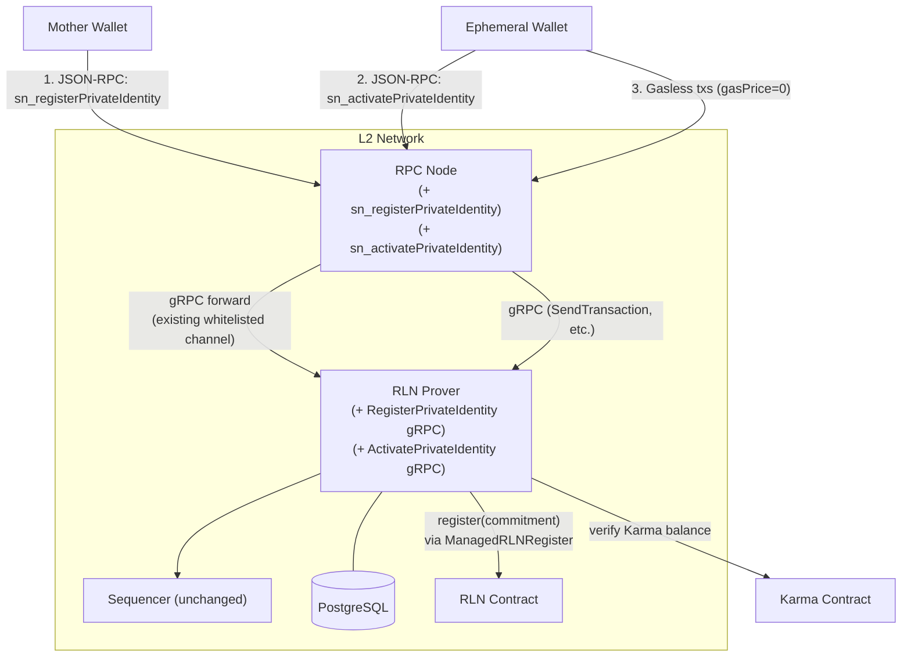
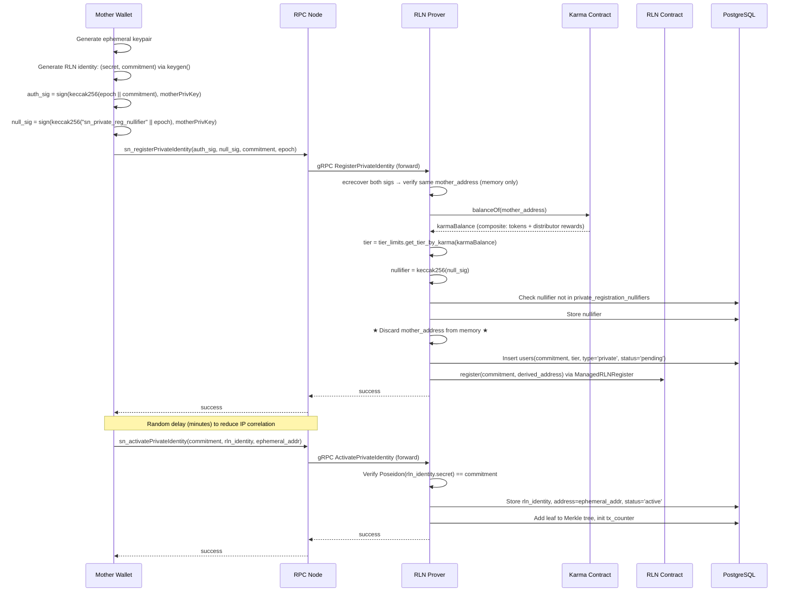

# Private Gasless Transactions

> Builds on top of the existing gasless architecture in [`docs/protocol-engineering.md`](./protocol-engineering.md).

## Problem

Right now the sender address is visible on every gasless transaction. When someone sends a gasless tx, their Karma-holding address (the "mother address") shows up on-chain, in the prover's database, in sequencer logs, and in block explorers. All gasless activity is directly tied to the user's permanent identity.

We want a way for users to spend their Karma-earned gasless quota without revealing which address holds the Karma.

---

## Goals

- Privacy is opt-in. Users who don't care about it are completely unaffected. Regular gasless transactions work exactly as they do today, no extra steps, no UX changes, no performance impact.
- For users who opt in: break the on-chain link between their Karma address and their transactional activity.
- Keep existing rate-limiting, quota enforcement, and slashing working for both regular and private users.
- Minimize engineering effort. Reuse `ManagedRLNRegister`, `NonceManager`, and the existing `REGISTER_ROLE` instead of building new on-chain infrastructure.
- Provide a clear upgrade path to fully trustless (ZK-based) registration if the prover trust assumption becomes unacceptable at scale.

Not in scope: hiding transaction contents, replacing Karma/RLN, privacy for premium (paid) transactions, IP-level transport privacy.

---

## Threat Model

| Adversary | Sees | Must NOT learn |
|-----------|------|----------------|
| On-chain observer | All txs, all addresses, RLN Merkle tree, contract state | Which mother address owns which ephemeral |
| RPC / Prover operator (live) | Registration request signatures (transient) | **Known limitation**: can ecrecover mother address from signatures. See [Trust Model](#trust-model). |
| Prover database (at rest / compromised) | Ephemeral address, RLN identity, tier, spent nullifier hashes | Mother identity behind the ephemeral |
| Sequencer operator | Tx payload, ephemeral sender address | Mother identity behind the ephemeral |

### Trust Model

The registration request contains two ECDSA signatures from the mother's private key. Anyone who sees these signatures can `ecrecover` the mother address. In practice, both the RPC node (which receives the JSON-RPC call) and the prover (which processes it via gRPC) can recover the address. The RPC node and prover are typically run by the same entity.

Why this is fine:

1. **The prover already holds every user's RLN identity secret** in the `users.rln_id` column ([`user_db_2.rs:313-321`](../rln-prover/prover/src/user_db_2.rs)). That's the cryptographic secret that gets recovered and slashed during RLN violations. If you don't trust the operator with a transient address, you shouldn't trust them with the permanent secret either.
2. **The link is not persistable without active malice.** A compromised prover database reveals nothing (see [Nullifier Design](#nullifier-design) for why). Only an operator actively logging requests at runtime can capture the mapping.
3. **There's an upgrade path.** If this trust assumption stops being acceptable at scale, the registration endpoint can be swapped for an on-chain ZK proof flow (see [Upgrade Path](#upgrade-path-to-zk-registration)) without touching any other component.

---

## How It Works

Two paths through the network. **Regular gasless** works exactly as it does today: user has Karma, the prover auto-registers them when they receive it, they transact from their main address. Nothing changes.

**Private gasless** is the new opt-in path. The mother wallet calls a JSON-RPC method on the RPC node, which forwards the request to the prover over the existing whitelisted gRPC channel. The prover checks the mother's Karma balance on-chain, derives the tier, registers the ephemeral's RLN commitment on-chain using the existing `ManagedRLNRegister` + `NonceManager`, and throws away the mother address. The ephemeral then activates (also via JSON-RPC through the RPC node) and transacts normally. From the network's perspective it's just another user with a tier and a quota.

The wallet never talks to the prover directly. It uses the same RPC node endpoint it already uses for `eth_sendRawTransaction` and `linea_estimateGas`. The RPC node proxies the two new methods to the prover over gRPC, same pattern as `RlnProverForwarderValidator` forwarding `SendTransaction` today.

Three things are different from the regular gasless path:

1. **Registration.** Instead of the prover auto-detecting a Karma mint via `KarmaScEventListener`, the mother explicitly requests private registration via `sn_registerPrivateIdentity`.
2. **Identity handoff.** The ephemeral wallet sends its RLN secret to the prover via `sn_activatePrivateIdentity`.
3. **Tier source.** For private users, the prover reads the tier from the `users.tier` column (set at registration time) instead of querying `karma_sc.balanceOf()` in real-time.

Everything downstream (proof generation, streaming, sequencer verification, deny list, nullifier tracking) works identically for both paths.

---

## RPC Node Changes

Two new JSON-RPC methods on the RPC node: `sn_registerPrivateIdentity` and `sn_activatePrivateIdentity`. These are thin pass-throughs to the prover, following the same pattern as `RlnProverForwarderValidator` which already forwards transaction data to the prover's `SendTransaction` gRPC endpoint. No business logic in the RPC node. Format validation, gRPC forward, return result.

Both methods are gated behind the same `--plugin-linea-rpc-gasless-enabled` flag that controls the existing gasless features. They only run on RPC nodes, not the sequencer.

---

## Prover Changes

Three changes to the prover. Zero changes to the sequencer or any smart contract.

### 1. New gRPC endpoint: `RegisterPrivateIdentity`

The RPC node forwards the wallet's registration request here. The request carries two ECDSA signatures (one for auth, one for nullifier derivation), the ephemeral's RLN commitment, and the current epoch.

Here's what the handler does:

1. `ecrecover` both signatures, verify they recover to the same `mother_address` (in memory only)
2. Verify the epoch is current
3. Query `karma_sc.balanceOf(mother_address)` and derive tier from the `tier_limits` table
4. If tier has 0 quota (no Karma or below minimum), reject
5. Compute the nullifier from the nullifier signature (see [Nullifier Design](#nullifier-design)) and check it's not already spent
6. Store the nullifier (not the address, not the signature)
7. Insert the user into the DB with the commitment, tier, `registration_type='private'`, and `activation_status='pending'`
8. Queue on-chain registration via `ManagedRLNRegister`: `RLN.register(commitment, derived_address)` where `derived_address` is deterministically derived from the commitment (see [On-chain Registration Address](#on-chain-registration-address))
9. Discard `mother_address` from memory. Never written to disk, database, or logs.
10. Return success. On-chain confirmation is handled asynchronously by `ManagedRLNRegister` + `NonceManager` with retry and gas-bumping. If the on-chain registration fails after all retries, the DB entry is rolled back (same pattern as regular registrations in [`karma_sc_listener.rs`](../rln-prover/prover/src/karma_sc_listener.rs)).

Step ordering matters. We insert into the DB first (step 7) and queue on-chain registration second (step 8). If the on-chain tx fails, we roll back the DB entry. This matches the existing registration pattern where the prover maintains the invariant that either both the DB and the contract have the user, or neither does.

#### Nullifier Design

A naive nullifier like `keccak256(mother_address, epoch)` would be brute-forceable. The set of Karma holders is public (every mint emits a `Transfer` event from `address(0)`) and small (thousands of addresses). An attacker with DB access could iterate through all Karma holders, compute the hash for each, and match against the stored nullifiers in milliseconds.

Instead, the nullifier is derived from a signature: `keccak256(nullifier_signature)` where `nullifier_signature = sign(keccak256("sn_private_reg_nullifier" || epoch), motherPrivKey)`. ECDSA with RFC 6979 is deterministic, so the same private key signing the same message always produces the same signature. This gives us:

- **Determinism**: same mother + same epoch = same nullifier, preventing double registration.
- **One-wayness**: `keccak256(signature)` can't be reversed to recover the address or the signature.
- **Brute-force resistance**: you'd need each mother's private key to reproduce their signature. Knowing their address is not enough.

The prover must normalize the nullifier signature to canonical low-s form (per EIP-2) before computing the hash. Given a valid ECDSA signature `(r, s)`, the signature `(r, n-s)` also ecrecovers to the same address but produces a different hash. Without normalization, a user could submit both variants and get two nullifiers per epoch.

#### On-chain Registration Address

The RLN contract's `register(uint256 commitment, address user)` stores the `user` parameter in `members[commitment].userAddress`, which is publicly readable. If we used the prover's address for all private registrations, anyone could call `members(commitment)` and immediately identify which registrations are private (all mapped to the same address) vs. regular (mapped to individual user addresses).

We use a deterministic per-commitment address instead: `address(uint160(uint256(keccak256(commitment))))`. Each registration gets a unique address derived from its commitment, so private registrations are indistinguishable from regular ones when inspected on-chain. This address has no Karma, so `karma.slash()` during slashing has no effect, which is fine since the real penalty is commitment removal (see [Slashing](#flow-4-slashing)).

#### Karma Balance

One thing worth noting: `balanceOf()` on the Karma contract returns the composite balance (actual tokens + virtual rewards from `SimpleKarmaDistributor` and other registered distributors). The prover calls this directly on-chain, so it gets the correct number. No need to deal with storage proofs or figure out the composite balance computation ourselves.

### 2. New gRPC endpoint: `ActivatePrivateIdentity`

After on-chain registration confirms, the ephemeral wallet hands its RLN identity secret to the prover (via the RPC node proxy) so the prover can generate proofs on its behalf. The request carries the RLN commitment, the full RLN identity (secret + commitment + rate limit, same shape as the `rln_id` column), and the ephemeral's address.

1. Look up the commitment in the `users` table where `activation_status = 'pending'`
2. Verify `Poseidon(rln_identity.secret)` matches the commitment. This IS the authentication: only someone who generated the commitment knows the matching secret.
3. Store the RLN identity, set the address to the ephemeral, set `activation_status = 'active'`
4. Add to the Merkle tree using `Poseidon(identity_commitment, rate_limit)`, same formula as regular users ([`user_db_2.rs:327`](../rln-prover/prover/src/user_db_2.rs))
5. Initialize a `tx_counter` row for the ephemeral
6. From here, `SendTransaction` from this ephemeral triggers normal proof generation

The prover should enforce a per-commitment attempt limit (e.g., 5 attempts) to prevent spam. Anyone can observe `MemberRegistered` events on-chain and try to activate against pending commitments. Poseidon preimage resistance makes brute-forcing the secret infeasible, but the spam itself wastes prover resources.

### 3. Modified `GetUserTierInfo` behavior

Currently ([`grpc_service.rs`](../rln-prover/prover/src/grpc_service.rs)) this queries `karma_sc.balanceOf(user)` on-chain and derives the tier from `tier_limits`. For private users (`registration_type = 'private'`), it reads the tier from the `users.tier` column instead. Response format is identical, so `KarmaServiceClient` and `LineaEstimateGas` see no difference.

The tier is locked to whatever the mother's Karma balance was at registration time. If a private user's Karma changes mid-epoch, their tier doesn't update until they re-register next epoch. This is fine since Karma changes are infrequent (minting via staking rewards, slashing).

### Database changes

Three new columns on the `users` table: `tier` (the tier name, set at registration), `registration_type` (`'karma_event'` for regular users, `'private'` for private), and `activation_status` (`'active'` for regular users, starts as `'pending'` for private until activation). Existing users default to `registration_type = 'karma_event'` and `activation_status = 'active'`.

A new `private_registration_nullifiers` table stores spent nullifiers (32-byte hash) with the epoch they were created in. Indexed by epoch for pruning.

---

## End-to-End Flows

### Flow 1: Private Registration

### Flow 2: Gasless Transaction (unchanged)

Same as `protocol-engineering.md` Steps 1-6. The ephemeral submits `gasPrice=0` txs to the RPC node. The prover looks up the ephemeral in its DB, reads the tier from the `users.tier` column (instead of querying Karma), and generates proofs. The sequencer validates through the same `RlnVerifierValidator` path. No component knows or cares that this user registered privately.

### Flow 3: Deny List Recovery

When a regular user hits their quota limit, they get added to the deny list and can recover by paying premium gas (>= 100 GWei). This doesn't work for private ephemerals. The ephemeral has no ETH (it exists solely for gasless transactions), and funding it from the mother would create an on-chain link between the two addresses, defeating the purpose.

Recovery options for private users:

1. **Wait for the deny list TTL to expire.** Entries have a TTL and get cleaned up automatically. Gasless access resumes without any action.
2. **Abandon the ephemeral and rotate next epoch.** The mother registers a fresh ephemeral when the new epoch starts. The old one's quota resets at epoch boundary anyway.

Both are passive. Private users don't get the "pay to recover immediately" option that regular users have. This is an acceptable trade-off for unlinkability.

### Flow 4: Slashing

Slashing works but with a reduced penalty compared to regular users:

1. Duplicate RLN nullifier detected by the sequencer's `NullifierTracker`
2. Shamir secret recovery from the two shares
3. `RLN.slash()` removes the commitment from the registry
4. The ephemeral loses gasless access immediately
5. `karma.slash()` targets the derived address (which has no Karma), so nothing gets burned

The effective penalty is up to 24 hours of lost gasless access. The registration epoch nullifier is already spent, so the mother can't register a replacement ephemeral until next epoch. This is weaker than regular users (who lose Karma), but exceeding the rate limit requires deliberately generating two proofs with the same nullifier, which provides no benefit since you just get denied.

### Flow 5: Ephemeral Rotation

Optional. When a new epoch starts, the mother signs a new registration request with the new epoch, gets a fresh nullifier, and registers a new ephemeral via `sn_registerPrivateIdentity`. The old ephemeral's quota resets at epoch boundary like any other user.

---

## Security Analysis

**Sybil via multiple mothers.** Karma is non-transferable and earned through staking. N identities costs N stakes. Tier "none" (0 Karma) gets 0 quota. Same economics as attacking the current system.

**Multiple ephemerals per epoch.** The nullifier is deterministic per mother per epoch (derived from a deterministic ECDSA signature over a fixed message). Second attempt gets rejected.

**On-chain indistinguishability.** Each private registration uses a unique deterministic address derived from its commitment. An observer looking at the RLN contract's `members` mapping sees unique addresses for every registration, same as regular users. The prover is the caller for all registrations (it holds `REGISTER_ROLE`), both regular and private, so the `msg.sender` doesn't help either.

**Prover DB compromise.** The `users` table has the ephemeral address, RLN identity, tier, and registration type. The nullifiers table has `keccak256(nullifier_signature)`. Neither reveals the mother address. The nullifier is derived from a signature, not from the address itself, so even an attacker who knows all Karma holder addresses can't match them against the nullifier table.

**Replay attacks on RegisterPrivateIdentity.** The auth signature covers `keccak256(epoch || rln_commitment)`. A replayed request in the same epoch hits the nullifier check. A replayed request targeting a different epoch fails epoch validation. A replayed request with a different commitment fails signature verification.

**Front-running ActivatePrivateIdentity.** Only someone who knows the RLN secret (used to derive the commitment via `keygen()`) can activate. The Poseidon commitment check is the authentication. An attacker who sees the `pending` registration can't activate it without the secret. Per-commitment attempt limits prevent resource exhaustion from spam.

**IP correlation.** The RPC node sees both `sn_registerPrivateIdentity` (from the mother's IP) and `sn_activatePrivateIdentity` (from the ephemeral's IP). If both come from the same IP, the operator can correlate them. The wallet SDK should add a random delay (minutes) between registration and activation. Users can also route activation through a different network path. This is a known limitation, documented in the [Threat Model](#threat-model).

**Reduced slashing penalty.** Private users lose gasless access when slashed but don't lose Karma. You can't slash Karma you can't attribute. The 24-hour lockout is sufficient since there's nothing to gain from exceeding the rate limit.

---

## Wallet Integration

From the wallet's perspective, private gasless transactions require:

1. **Generate an ephemeral Ethereum keypair.** Standard secp256k1 keygen.
2. **Generate an RLN identity.** A `(secret, commitment)` pair where `commitment = Poseidon(secret)`. This is one Poseidon hash over BN254, not a ZK proof. Requires either a WASM build of [zerokit](https://github.com/vacp2p/zerokit)'s keygen or a JS reimplementation (generate random BN254 scalar, compute one Poseidon hash).
3. **Sign two messages** with the mother's private key (standard `eth_sign`).
4. **Call `sn_registerPrivateIdentity`** on the same RPC endpoint the wallet already uses.
5. **Wait a few minutes** (random delay for IP correlation mitigation).
6. **Call `sn_activatePrivateIdentity`** on the same RPC endpoint.
7. **Use the ephemeral** for gasless transactions via `eth_sendRawTransaction` as normal.

No gRPC client needed. No ZK proofs. No new endpoints to discover. The wallet talks to the same RPC node it already talks to.

---

## Migration Plan

### Phase 1: Build + Deploy

1. **DB migration**: Add columns to `users`, create nullifier table.
2. **Prover: `RegisterPrivateIdentity`**: New gRPC endpoint with dual-signature verification, signature-based nullifier, and `ManagedRLNRegister` integration.
3. **Prover: `ActivatePrivateIdentity`**: New gRPC endpoint with commitment verification, identity storage, Merkle tree insertion, and per-commitment attempt limits.
4. **Prover: `GetUserTierInfo` dual-path**: Branch on `registration_type`.
5. **RPC node**: Two new JSON-RPC methods that forward to the prover over the existing gRPC channel. Gate behind `--plugin-linea-rpc-gasless-enabled`. 
6. **Client**: Wallet SDK or script for generating ephemeral keypairs, producing both signatures, and calling the two new JSON-RPC methods.
7. **Testing**: E2E test covering private registration, activation, gasless tx, deny list expiry, and ephemeral rotation.

### Phase 2: Monitor + Iterate

- Monitor private registration usage
- Implement nullifier pruning (delete entries older than 2 epochs)
- Add pending registration TTL cleanup (1 epoch)
- Tune IP correlation mitigations based on observed patterns
- Add per-IP rate limiting for `sn_registerPrivateIdentity` at the RPC node level

---

## Upgrade Path to ZK Registration

If the prover trust assumption stops being acceptable (the network decentralizes to multiple independent provers, or there's a regulatory requirement for trustless privacy), the `RegisterPrivateIdentity` gRPC endpoint can be swapped for an on-chain ZK proof flow:

1. Deploy a `KarmaCommitmentTree`, a Poseidon-based Merkle tree that mirrors Karma balances on-chain. The prover's existing `pg_merkle_tree` PostgreSQL extension and Poseidon hashing infrastructure can serve as a reference implementation.
2. Deploy a `PrivateRLNRegistrar` with on-chain Groth16 verification
3. Build a ZK circuit proving Karma balance membership in the commitment tree (~100k constraints with Poseidon, 2-5 second client-side proving)
4. Replace `sn_registerPrivateIdentity` with an on-chain `registerPrivate()` transaction
5. Add a gasless whitelist for `PrivateRLNRegistrar` calls in `RlnVerifierValidator` so registration itself doesn't leak identity via gas payment

`ActivatePrivateIdentity`, `GetUserTierInfo` dual-path, the DB schema, and the entire downstream pipeline carry over unchanged. The prover-mediated approach builds exactly the interfaces the ZK upgrade needs.

---

## Open Design Decisions

1. **Pending registration TTL.** How long should a pending registration stay activatable? If the ephemeral never activates, the commitment is registered on-chain but never used. We should add a TTL (maybe 1 epoch) after which unactivated registrations get cleaned up. The on-chain commitment is effectively wasted, but that's a minor cost absorbed by the prover's gas budget.

2. **Registration rate limiting.** The RPC node should rate-limit `sn_registerPrivateIdentity` calls per IP. The nullifier prevents double registration per epoch per mother, but a malicious caller could spam invalid requests (wrong signatures, zero-Karma addresses) to waste prover resources.
