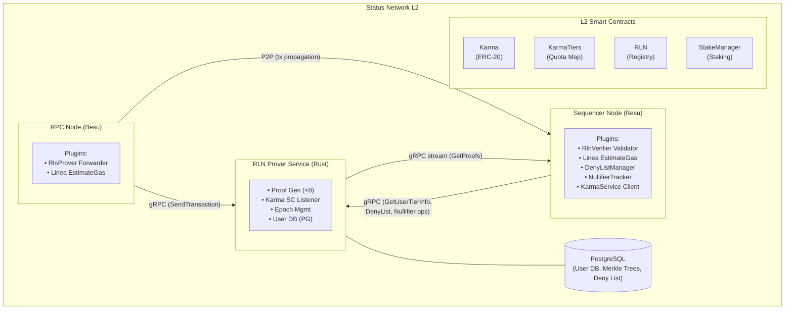

# Status Network Protocol Engineering

## Table of Contents

1. [Introduction](#introduction)
2. [Architecture Overview](#architecture-overview)
3. [Gasless Transaction Flow (End-to-End)](#gasless-transaction-flow-end-to-end)
4. [Component Deep Dives](#component-deep-dives)
   - [RPC Node Layer](#rpc-node-layer)
   - [RLN Prover Service](#rln-prover-service)
   - [Sequencer Node Layer](#sequencer-node-layer)
5. [Smart Contract Integration](#smart-contract-integration)
6. [Epoch and Quota Management](#epoch-and-quota-management)
7. [Security Mechanisms](#security-mechanisms)
8. [Configuration Reference](#configuration-reference)
9. [Deployment Topologies](#deployment-topologies)

---

## Introduction

Status Network is the first natively gasless Ethereum L2, built on top of the Linea zkEVM stack. The core protocol engineering challenge was: **how do you allow users to send transactions without paying gas fees, while preventing spam and denial-of-service attacks?**

The answer combines three technologies:

1. **RLN (Rate Limiting Nullifier)** — A zero-knowledge proof system from [Vac/Waku](https://github.com/vacp2p/zerokit) that cryptographically enforces per-user rate limits without revealing user identity
2. **Karma** — A non-transferable ERC-20 reputation token that determines each user's tier and daily gasless transaction quota
3. **Besu Plugin Extensions** — Custom transaction pool validators and RPC modifications to the Linea Besu client that orchestrate proof generation, verification, and quota enforcement

This document details the protocol engineering work that went into making these components work together as a production system.

### What This Document Covers

- **RPC Node Modifications**: How Besu RPC nodes were extended with the `RlnProverForwarderValidator` and modified `LineaEstimateGas` to enable gasless transaction submission
- **RLN Prover Service**: The Rust gRPC service that generates Groth16 zero-knowledge proofs for rate limiting, manages user registrations, and tracks quotas
- **Sequencer Modifications**: How the sequencer was extended with the `RlnVerifierValidator` to verify proofs, enforce quotas, and manage deny lists
- **Integration Architecture**: How all components communicate via gRPC streaming, shared services, and on-chain contract events

### What Is Already Documented Elsewhere

- **Smart Contract Specifications**: See [`status-network-contracts/docs/`](../status-network-contracts/docs/) for Karma, KarmaTiers, RLN Registry, StakeManager, and reward distribution documentation
- **Linea Base Architecture**: See [`docs/architecture-description.md`](./architecture-description.md) for the underlying Linea zkEVM stack (sequencer, coordinator, provers, L1/L2 messaging)
- **Contract Deployment**: See [`docs/status-network-deployment.md`](./status-network-deployment.md) for deployment procedures

---

## Architecture Overview

### System Topology



**Key gRPC flows:**
- **RPC Node → Prover**: `SendTransaction` — forwards tx data for proof generation
- **Prover → Sequencer**: `GetProofs` stream — delivers generated proofs
- **Sequencer → Prover**: `GetUserTierInfo`, deny list ops, nullifier ops — quota enforcement

### Node Roles

| Component | Role | Key Plugins/Validators | Facing |
|-----------|------|----------------------|--------|
| **RPC Node** | Accepts user transactions, forwards to prover | `RlnProverForwarderValidator`, `LineaEstimateGas` | User-facing |
| **RLN Prover** | Generates ZK proofs, manages quotas | gRPC service, Proof workers, Karma listener | Internal |
| **Sequencer** | Verifies proofs, enforces quotas, builds blocks | `RlnVerifierValidator`, `DenyListManager`, `NullifierTracker` | Internal |

---

## Gasless Transaction Flow (End-to-End)

This section traces a single gasless transaction from a user's wallet through the entire system.

### Prerequisites

A user must meet these conditions to use gasless transactions:

1. **RLN Membership**: The user must be registered in the RLN Registry smart contract. Registration happens automatically when the user receives Karma tokens — the `KarmaScEventListener` in the prover service detects the `Transfer` event (minting) and registers the user's identity commitment in the RLN contract.

2. **Karma Balance**: The user must hold enough Karma (non-transferable ERC-20) tokens to qualify for a tier in `KarmaTiers`. Each tier defines a daily gasless transaction quota. Higher Karma balance = higher tier = more free transactions.

3. **Available Quota**: The user's epoch transaction count must be below their tier's quota limit.

### Step 1: Gas Estimation (`linea_estimateGas`)

The user's wallet calls `linea_estimateGas` on the RPC node. The modified implementation (`LineaEstimateGas.java`) performs:

```
1. Check gas kill switch → if active, skip gasless logic entirely
2. Check if gasless features are enabled → if not, standard estimation
3. Resolve sender address from call parameters
4. Check deny list (DenyListManager):
   ├─ If sender IS denied:
   │   ├─ Estimate gas normally
   │   ├─ Multiply gas limit by premium multiplier (default 1.5x)
   │   ├─ Enforce priorityFee ≥ premiumGasPriceThreshold (converted to Wei)
   │   └─ Return {gasLimit: premiumEstimate, baseFee: actual, priorityFee: premiumThreshold}
   │
   └─ If sender is NOT denied:
       ├─ Query KarmaServiceClient for user tier info
       ├─ Check: dailyQuota > 0 AND epochTxCount < dailyQuota
       │
       ├─ If eligible for gasless:
       │   └─ Return {gasLimit: "0x0", baseFee: "0x0", priorityFee: "0x0"}
       │
       └─ If NOT eligible (no quota, unknown user, or karma service unavailable):
           ├─ Estimate gas normally
           ├─ Multiply gas limit by premium multiplier (default 1.5x)
           ├─ Enforce priorityFee ≥ premiumGasPriceThreshold (converted to Wei)
           └─ Return {gasLimit: premiumEstimate, baseFee: actual, priorityFee: premiumThreshold}
```

**Source**: [`LineaEstimateGas.java:223-375`](../besu-plugins/linea-sequencer/sequencer/src/main/java/net/consensys/linea/rpc/methods/LineaEstimateGas.java)

The zero-gas response is the signal to the wallet that this transaction can be submitted with `gasPrice = 0`. The wallet constructs and signs a transaction with zero gas price. The premium response ensures the `priorityFee` is at least the premium gas price threshold (default 100 GWei, configurable via `premiumGasPriceThresholdGWei`). This is critical on Status Network where both `baseFee` and `minGasPrice` are zero — without this enforcement, the standard priority fee estimation would return near-zero values, causing wallets to submit transactions with gas prices in the "dead zone" between 0 and the premium threshold that the sequencer rejects.

### Step 2: Transaction Submission (`eth_sendRawTransaction`)

The signed transaction arrives at the RPC node's transaction pool. Besu invokes its chain of transaction pool validators. The `RlnProverForwarderValidator` executes as part of this chain.

```
1. Check if validator is enabled (disabled on sequencer nodes)
2. Check gas kill switch → if active, allow tx without forwarding (passes to standard validation)
3. Check if transaction is local → peer transactions are accepted without forwarding
4. Check premium gas bypass:
   ├─ Compute effective gas price (gasPrice or maxFeePerGas)
   └─ If effectiveGasPrice >= premiumThreshold → allow without RLN forwarding
5. Query karma service (informational, not blocking):
   ├─ Log "GASLESS PRIORITY" if user has available quota
   └─ Continue regardless of result
6. Estimate actual gas used:
   ├─ Simple ETH transfer with no calldata → 21,000
   ├─ Full simulation available → simulate and get exact gas used
   └─ Fallback → use transaction gas limit
7. Build gRPC SendTransactionRequest:
   ├─ transactionHash (32 bytes)
   ├─ sender address (20 bytes)
   ├─ gasPrice (if available)
   ├─ chainId (if available)
   └─ estimatedGasUsed (uint64)
8. Send to RLN Prover Service via blocking gRPC call
9. Handle response:
   ├─ Prover accepted → allow transaction
   ├─ Prover rejected → reject transaction
   └─ gRPC error → ALLOW transaction (fail-open design)
```

**Source**: [`RlnProverForwarderValidator.java:256-446`](../besu-plugins/linea-sequencer/sequencer/src/main/java/net/consensys/linea/sequencer/txpoolvalidation/validators/RlnProverForwarderValidator.java)

After the forwarder validator allows the transaction, Besu's standard transaction pool propagation sends the transaction to the sequencer node via P2P.

### Step 3: RLN Proof Generation (Prover Service)

The prover service receives the `SendTransactionRequest` via gRPC and begins proof generation:

```
1. Validate sender exists in user database
2. Check gas kill switch → if active, return Status::unavailable()
3. Compute quota increment: estimated_gas_used / tx_gas_quota
4. Increment user's epoch transaction counter in PostgreSQL
5. Check rate limit:
   ├─ Look up user's tier from KarmaTiers contract
   ├─ effective_limit = tier_limit OR global_spam_limit (fallback)
   └─ If counter > effective_limit → return Status::resource_exhausted()
6. Queue ProofGenerationData to bounded async channel (capacity: 256)
7. Return SendTransactionReply { result: true }
```

Meanwhile, one of 8 `ProofService` worker threads picks up the queued proof request:

```
1. Fetch Merkle proof for user from PostgreSQL (path_indexes, path_elements)
2. Spawn CPU-bound Rayon task:
   a. Prepare RLN data:
      ├─ message_id = tx_counter (from epoch counter)
      ├─ data = hash_to_field_le(tx_hash)  // Transaction hash as field element
      └─ identity = user's RLN identity secret
   b. Prepare epoch:
      ├─ epoch_bytes = current_epoch || current_epoch_slice
      └─ epoch = hash_to_field_le(epoch_bytes)
   c. Call compute_rln_proof_and_values() (Groth16 ZK-SNARK)
      └─ Returns: (proof, proof_values) containing:
         ├─ share_x: X-coordinate of Shamir secret share
         ├─ share_y: Y-coordinate of Shamir secret share
         ├─ epoch: Epoch field element
         ├─ root: Merkle tree root
         └─ nullifier: Unique nullifier for this tx in this epoch
   d. Serialize proof (288 bytes)
3. Broadcast ProofSendingData {tx_hash, tx_sender, proof} to all subscribers
```

**Source**: [`grpc_service.rs`](../rln-prover/prover/src/grpc_service.rs), [`proof_service.rs`](../rln-prover/prover/src/proof_service.rs)

### Step 4: Proof Delivery via gRPC Streaming

The sequencer maintains a persistent gRPC streaming subscription to the prover service via `GetProofs()`. When a proof is broadcast:

```
Prover Service                          Sequencer
     │                                      │
     │  broadcast::Sender<ProofSendingData> │
     │ ────────────────────────────────────▶ │
     │                                      │
     │  GetProofs() stream (server-side)    │
     │  ◀────────────────────────────────── │
     │                                      │
     │  RlnProofReply { proof: RlnProof }   │
     │ ────────────────────────────────────▶ │
     │                                      │
     │                           StreamObserver.onNext():
     │                           1. Extract tx_hash from proof
     │                           2. Parse proof via JNI (parseAndVerifyRlnProof)
     │                           3. Extract public inputs (share_x, share_y, epoch, root, nullifier)
     │                           4. If valid: cache in Caffeine LRU cache
     │                           5. Complete any CompletableFuture waiting for this tx_hash
```

The streaming approach means proofs arrive asynchronously and are cached before the sequencer's validator needs them. The Caffeine cache is configured with:
- **TTL**: 300 seconds (5 minutes)
- **Max size**: 10,000 proofs
- **Eviction**: LRU with time-based expiry

### Step 5: Sequencer Validation (`RlnVerifierValidator`)

When the transaction arrives at the sequencer's transaction pool (via P2P propagation), the `RlnVerifierValidator` runs as part of the validator chain:

```
1. Check if RLN validation is enabled → if disabled, allow
2. Check priority status → infrastructure/deployment txs bypass RLN entirely
3. Compute effective gas price
4. Gas Kill Switch Check:
   ├─ If active AND gas >= premium threshold → allow (paid tx)
   └─ If active AND gas < premium threshold → REJECT ("Gas kill switch active")
5. Deny List Check:
   ├─ If denied AND gas >= premium threshold:
   │   ├─ Remove from deny list (user is paying premium)
   │   └─ Continue to RLN validation (still verify proof)
   └─ If denied AND gas < premium threshold → REJECT ("Sender on deny list")
6. Global Premium Gas Bypass:
   └─ If gas >= premium threshold → allow without RLN validation
7. Pre-check Karma Quota (fast rejection):
   ├─ Query KarmaServiceClient
   ├─ If epochTxCount > dailyQuota → REJECT immediately ("Quota exceeded")
   └─ If epochTxCount == dailyQuota → add to deny list, continue (last allowed tx)
8. Wait for RLN Proof in Cache:
   ├─ Check Caffeine cache for tx_hash
   ├─ If not found: create CompletableFuture and wait
   ├─ Timeout: configurable (default 1000ms)
   └─ If still not found after timeout → REJECT ("Proof not found after timeout")
9. Validate Proof Epoch:
   ├─ Check proof epoch against current epoch
   ├─ Allow tolerance window (±2 blocks for BLOCK mode, ±1 hour for TIMESTAMP_1H)
   └─ If outside window → REJECT ("Proof epoch outside acceptable window")
10. Check Nullifier Uniqueness:
    ├─ NullifierTracker.checkAndMarkNullifier(nullifier, proofEpoch)
    ├─ If nullifier already used → REJECT ("Nullifier already used - double-spend")
    └─ Mark nullifier as used for this epoch
11. Final Karma Quota Check:
    ├─ Query KarmaServiceClient again
    ├─ If epochTxCount > dailyQuota → REJECT ("Quota exceeded")
    ├─ If epochTxCount == dailyQuota → add to deny list (last tx)
    └─ If epochTxCount < dailyQuota → ALLOW
12. Transaction enters mempool → block building proceeds normally
```

**Source**: [`RlnVerifierValidator.java:924-1201`](../besu-plugins/linea-sequencer/sequencer/src/main/java/net/consensys/linea/sequencer/txpoolvalidation/validators/RlnVerifierValidator.java)

### Step 6: Block Building

Once the transaction passes all validators (including the standard Linea validators for trace limits, gas limits, calldata, profitability, and simulation), it enters the sequencer's transaction pool. The standard Linea block building process picks it up and includes it in a block. The transaction executes with `gasPrice = 0` — the user pays nothing.

---

## Component Deep Dives

### RPC Node Layer

The RPC node is a Besu instance running with `--plugin-linea-node-type=RPC`. It has two critical Status Network modifications:

#### Modified `LineaEstimateGas` RPC

**File**: [`LineaEstimateGas.java`](../besu-plugins/linea-sequencer/sequencer/src/main/java/net/consensys/linea/rpc/methods/LineaEstimateGas.java)

The standard Linea `linea_estimateGas` endpoint was extended with gasless logic that runs before the standard estimation. The modification adds three dependencies injected via `SharedServiceManager`:

- **`DenyListManager`** — Read-only access to the deny list (backed by gRPC to the prover service)
- **`KarmaServiceClient`** — Queries user tier and quota information from the prover service
- **`GasKillSwitchMonitor`** — File-based emergency disable for all gasless features

The gasless logic is bounded by `// --- Linea Gasless Logic Start ---` and `// --- Linea Gasless Logic End ---` markers in the source. The endpoint enforces the two-mode gas pricing model — it only ever returns zero gas or premium gas:

| Scenario | gasLimit | baseFee | priorityFee |
|----------|----------|---------|-------------|
| **Gasless** — User has Karma + available quota | `0x0` | `0x0` | `0x0` |
| **Premium** — User on deny list, no Karma, quota exhausted, or karma service unavailable | Normal × 1.5 | Actual | max(estimated, premiumThreshold) |

The zero response is the signal that triggers the wallet to submit a zero-gas transaction. The premium response ensures the `priorityFee` is at least the premium gas price threshold (`premiumGasPriceThresholdGWei` converted to Wei). This is enforced by `enforcePremiumMinPriorityFee()`, which takes the maximum of the standard estimation and the configured threshold. Without this, on a zero-baseFee chain the standard estimation returns near-zero, and wallets would submit transactions that the sequencer rejects.

**Configuration flags**:
- `--plugin-linea-rpc-gasless-enabled=true` — Enables the gasless code path
- `--plugin-linea-rpc-allow-zero-gas-estimation-for-gasless=true` — Allows returning 0 gas

#### `RlnProverForwarderValidator`

**File**: [`RlnProverForwarderValidator.java`](../besu-plugins/linea-sequencer/sequencer/src/main/java/net/consensys/linea/sequencer/txpoolvalidation/validators/RlnProverForwarderValidator.java)

This validator is added to the Besu transaction pool validation chain exclusively on RPC nodes (`--plugin-linea-rpc-rln-prover-forwarder-enabled=true`). It implements `PluginTransactionPoolValidator` and is positioned first in the validator chain (before trace limit, gas limit, calldata, and profitability validators).

**Gas estimation for proof generation**: A critical implementation detail is that the forwarder estimates the actual gas the transaction will use before forwarding to the prover. This is necessary because the prover uses gas consumption to calculate how many quota units the transaction consumes (`estimated_gas_used / tx_gas_quota`). Three strategies are used:

1. **Fast path**: Simple ETH transfers with empty calldata → hardcoded 21,000 gas
2. **Simulation**: If `TransactionSimulationService` is available, run a full EVM simulation
3. **Fallback**: Use the transaction's declared gas limit

**Statistics tracking**: The validator maintains `AtomicInteger` counters for monitoring:
- `validationCallCount` — Total validation calls
- `localTransactionCount` — Local transactions forwarded
- `peerTransactionCount` — Peer transactions skipped
- `grpcSuccessCount` / `grpcFailureCount` — gRPC outcome tracking
- `karmaBypassCount` — Transactions with gasless priority

#### Validator Chain Order

**File**: [`LineaTransactionPoolValidatorFactory.java`](../besu-plugins/linea-sequencer/sequencer/src/main/java/net/consensys/linea/sequencer/txpoolvalidation/LineaTransactionPoolValidatorFactory.java)

The factory assembles validators differently based on node type:

**RPC Node validator chain**:
1. `RlnProverForwarderValidator` ← Status Network addition
2. `TraceLineLimitValidator`
3. `AllowedAddressValidator`
4. `GasLimitValidator`
5. `CalldataValidator`
6. `ProfitabilityValidator`
7. `SimulationValidator`

**Sequencer validator chain**:
1. `TraceLineLimitValidator`
2. `AllowedAddressValidator`
3. `GasLimitValidator`
4. `CalldataValidator`
5. `ProfitabilityValidator`
6. `RlnVerifierValidator` ← Status Network addition
7. `SimulationValidator`

Note: `RlnProverForwarderValidator` only runs on RPC nodes; `RlnVerifierValidator` only runs on the sequencer. They are mutually exclusive.

#### SharedServiceManager

**File**: [`SharedServiceManager.java`](../besu-plugins/linea-sequencer/sequencer/src/main/java/net/consensys/linea/sequencer/txpoolvalidation/shared/SharedServiceManager.java)

This singleton manages the lifecycle of shared gasless services. It is initialized once during plugin startup and injected into both `LineaEstimateGas` and the validators. Services managed:

| Service | Purpose | Backend |
|---------|---------|---------|
| `DenyListManager` | TTL-based deny list with gRPC sync | gRPC to prover's deny list endpoints |
| `KarmaServiceClient` | User tier and quota queries | gRPC `GetUserTierInfo` on prover |
| `NullifierTracker` | Nullifier deduplication (1M capacity, 2× epoch TTL) | In-memory Caffeine cache |
| `GasKillSwitchMonitor` | Emergency gasless disable | File polling (configurable path) |

Gasless services are initialized when any of these flags are true:
- `--plugin-linea-rln-enabled=true`
- `--plugin-linea-rpc-gasless-enabled=true`
- `--plugin-linea-rpc-rln-prover-forwarder-enabled=true`

---

### RLN Prover Service

The RLN Prover is a standalone Rust service that handles zero-knowledge proof generation, user management, and quota tracking. It is the central coordination point for gasless transactions.

**Source**: [`rln-prover/`](../rln-prover/)

#### gRPC Service Definition

**Proto file**: [`rln-prover/proto/net/vac/prover/prover.proto`](../rln-prover/proto/net/vac/prover/prover.proto)

```protobuf
service RlnProver {
  // Core proof generation
  rpc SendTransaction(SendTransactionRequest) returns (SendTransactionReply);
  rpc GetProofs(RlnProofFilter) returns (stream RlnProofReply);

  // Karma/Quota queries (used by Besu's KarmaServiceClient)
  rpc GetUserTierInfo(GetUserTierInfoRequest) returns (GetUserTierInfoReply);

  // Deny List management (used by Besu's DenyListManager)
  rpc IsDenied(IsDeniedRequest) returns (IsDeniedReply);
  rpc AddToDenyList(AddToDenyListRequest) returns (AddToDenyListReply);
  rpc RemoveFromDenyList(RemoveFromDenyListRequest) returns (RemoveFromDenyListReply);
  rpc GetDenyListEntry(GetDenyListEntryRequest) returns (GetDenyListEntryReply);

  // Nullifier tracking (used by Besu's NullifierTracker)
  rpc CheckNullifier(CheckNullifierRequest) returns (CheckNullifierReply);
  rpc RecordNullifier(RecordNullifierRequest) returns (RecordNullifierReply);
  rpc CheckAndRecordNullifier(CheckAndRecordNullifierRequest) returns (CheckAndRecordNullifierReply);
}
```

#### Proof Generation Pipeline

The proof generation pipeline is the most performance-critical component. It uses a multi-stage architecture:

**Stage 1: Request Acceptance** (`grpc_service.rs`)
- Validates sender exists in the user database
- Computes quota increment: `ceil(estimated_gas_used / tx_gas_quota)`
- Atomically increments the user's epoch transaction counter in PostgreSQL
- Performs rate limiting check against the user's tier limit
- Enqueues a `ProofGenerationData` struct to a bounded async channel (capacity 256)

**Stage 2: Proof Computation** (`proof_service.rs`)
- Worker instances (configurable via `--proof-service`, default 8) consume from the async channel
- Each worker fetches the user's Merkle proof from PostgreSQL
- Spawns a CPU-bound Rayon task to perform the actual Groth16 proof computation:
  ```
  Input:
    - identity_secret: User's RLN identity (from registration)
    - path_elements: Merkle tree sibling hashes
    - path_indexes: Left/right path through Merkle tree
    - message_id: Transaction counter (message_id within epoch)
    - data: hash_to_field_le(transaction_hash)
    - epoch: hash_to_field_le(current_epoch || current_epoch_slice)
    - rln_identifier: Network-specific identifier string

  Output (public inputs):
    - share_x: X-coordinate of Shamir secret share
    - share_y: Y-coordinate of Shamir secret share
    - nullifier: Unique per-epoch nullifier (prevents double-spending)
    - root: Merkle tree root proving membership
    - epoch: The epoch field element used in proof
  ```

**Stage 3: Broadcast** (`proof_service.rs`)
- The serialized proof (288 bytes) is broadcast via a Tokio broadcast channel
- All `GetProofs` stream subscribers receive the proof in real-time
- Metrics are recorded: `PROOF_SERVICE_GEN_PROOF_TIME`, `PROOF_SERVICE_PROOF_COMPUTED`

**Rate Limit Edge Case**: When `tx_counter == rate_limit`, the proof service uses `message_id = tx_counter - 1`. This is a protocol requirement of the Zerokit RLN implementation — the verifier needs to be able to recover the secret hash from the Shamir shares, which requires the message_id to be within the valid range.

#### User Registration Flow

The `KarmaScEventListener` monitors the Karma ERC-20 contract for `Transfer` events from the zero address (minting):

```
Karma Contract emits Transfer(from=0x0, to=user, amount)
    │
    ▼
KarmaScEventListener detects mint event
    │
    ├─ Check: user balance ≥ minimal_amount?
    │   └─ If balance too low: skip registration
    │
    ├─ Register user in PostgreSQL:
    │   ├─ Generate RLN identity commitment
    │   ├─ Insert into users table
    │   └─ Add to Merkle tree
    │
    └─ Register identity on RLN smart contract:
        ├─ Call rln_sc.register_user(address, identity_commitment)
        │
        ├─ If SC registration fails:
        │   ├─ Rollback: remove user from PostgreSQL
        │   └─ Panic (data inconsistency)
        │
        └─ If rollback also fails: Panic (unrecoverable)
```

The registration is atomic — either both the database and the smart contract have the user, or neither does. A failure in the smart contract call triggers a database rollback, and if the rollback fails, the service panics (unrecoverable data inconsistency).

#### Epoch Management

The `EpochService` manages quota reset cycles:

| Setting | Production | Testing |
|---------|-----------|---------|
| Epoch duration | 24 hours (86,400s) | 60 seconds |
| Epoch slice | 2 minutes (120s) | 10 seconds |
| Slices per epoch | 720 | 6 |

**Epoch calculation**:
```
current_epoch = (now - genesis) / epoch_duration
current_epoch_slice = ((now - genesis) % epoch_duration) / epoch_slice_duration
```

At each epoch transition, the `UserDbService` resets all users' transaction counters to zero in PostgreSQL.

The epoch slice subdivision provides finer-grained time windows for proof generation. The proof's epoch field element is computed as `hash_to_field_le(epoch_bytes)` where `epoch_bytes = current_epoch || current_epoch_slice`.

#### Database Schema

PostgreSQL stores:
- **`users`**: Address → RLN identity commitment mapping
- **`tx_counter`**: Address → (epoch, epoch_counter) for quota tracking
- **`m_tree_config`**: Merkle tree configurations (depth, next_index per tree)
- **`pgfr_mtree_N`**: Per-tree node storage for RLN membership Merkle trees (via `pg_merkle_tree` extension)
- **`tier_limits`**: Tier name → quota limit (synced from KarmaTiers contract)
- **`deny_list`**: Address → (denied_at, expires_at, reason) with TTL
- **`nullifiers`**: Per-epoch nullifier storage for replay prevention

---

### Sequencer Node Layer

The sequencer is a Besu instance running with `--plugin-linea-node-type=SEQUENCER`. It has the authoritative enforcement role.

#### `RlnVerifierValidator`

**File**: [`RlnVerifierValidator.java`](../besu-plugins/linea-sequencer/sequencer/src/main/java/net/consensys/linea/sequencer/txpoolvalidation/validators/RlnVerifierValidator.java)

This is the most complex component. Key architectural decisions:

**Static shared state**: The proof cache, pending futures, and gRPC subscription are all `static` fields. This is critical because Besu's `createTransactionValidator()` creates new validator instances for each validation call. Without static sharing, each instance would create its own gRPC subscription and cache, leading to missed proofs.

**CompletableFuture-based proof waiting**: When a transaction arrives before its proof, the validator creates a `CompletableFuture<CachedProof>` and waits (with configurable timeout). When the proof arrives via the gRPC stream, the `StreamObserver.onNext()` handler completes the future, unblocking the validation thread. This avoids polling and provides efficient thread utilization.

**Concurrency limits**: A maximum of 100 concurrent proof waits is enforced via `AtomicInteger` counter. This prevents resource exhaustion if many transactions arrive simultaneously without proofs.

**Proof verification via JNI**: The validator uses `JniRlnVerificationService` which calls into the Rust `zerokit` library via JNI. The `parseAndVerifyRlnProof` method both parses the serialized proof and cryptographically verifies it. Only verified proofs are cached.

**Epoch validation strategy**: Different epoch modes have different tolerance windows:

| Mode | Current Epoch | Tolerance |
|------|--------------|-----------|
| `BLOCK` | SHA-256 hash of block number | ±2 blocks |
| `TIMESTAMP_1H` | SHA-256 hash of hourly timestamp | ±1 hour |
| `TEST` / `FIXED_FIELD_ELEMENT` | Hardcoded values | Always valid |

**gRPC stream resilience**: The proof stream subscription implements exponential backoff reconnection:
- Base delay from configuration (`rlnProofStreamRetryIntervalMs`)
- Exponential increase: `delay = base × 2^(retry_count)`
- Maximum delay capped at `maxBackoffDelayMs`
- Maximum retry attempts before giving up (`rlnProofStreamRetries`)
- Retry count resets on any successful message

#### DenyListManager

The deny list is a shared data structure across `LineaEstimateGas` and `RlnVerifierValidator`. It provides:

- **Write access** from `RlnVerifierValidator`: Users are added when they reach their quota limit
- **Read access** from `LineaEstimateGas`: Denied users receive premium gas estimates instead of zero
- **TTL expiration**: Deny list entries expire automatically
- **Premium gas redemption**: Users on the deny list can remove themselves by paying premium gas in their next transaction

The deny list is backed by the prover service's PostgreSQL database via gRPC calls, ensuring consistency across node restarts.

#### NullifierTracker

The nullifier tracker prevents the same RLN proof from being used twice within an epoch. It uses a high-performance in-memory cache:

- **Capacity**: 1,000,000 entries (supports 500+ TPS)
- **TTL**: 2× epoch duration (ensures coverage across epoch boundaries)
- **Operation**: `checkAndMarkNullifier(nullifier, epoch)` — atomic check-and-set

If a nullifier has been seen before in the same epoch, the transaction is rejected with a security violation error. This prevents replay attacks where someone captures a valid proof and submits it multiple times.

---

## Smart Contract Integration

The gasless system relies on four key smart contracts. Full contract documentation is in [`status-network-contracts/docs/`](../status-network-contracts/docs/), but here is how they integrate with the protocol layer:

### Karma (ERC-20)

- **Non-transferable**: Users cannot send Karma to others (transfer whitelisting controls exceptions)
- **Integration point**: The prover's `KarmaScEventListener` watches for `Transfer` events from zero address (minting) to detect new users who should be registered for RLN
- **Balance check**: The `GetUserTierInfo` gRPC call reads the user's Karma balance from the contract to determine their tier

### KarmaTiers

- **Tier → Quota mapping**: Each tier defines a name and a daily transaction quota limit
- **Integration point**: The prover's `TiersListener` watches for tier updates on-chain and syncs them to PostgreSQL
- **Example tiers**:
  | Tier | Min Karma | Daily Quota |
  |------|-----------|-------------|
  | Bronze | 1 | 100 |
  | Silver | 100 | 500 |
  | Gold | 1000 | 2000 |

### RLN Registry

- **Identity commitments**: Stores Poseidon hash commitments for each registered user
- **Integration point**: The prover calls `register_user()` when a new user is detected via Karma events
- **Slashing**: If a user is slashed (via the commit-reveal mechanism), the `AccountSlashed` event triggers user removal from the prover's database

### StakeManager

- **Staking rewards**: Users earn Karma by staking, which flows through reward distributors
- **Integration point**: Staking creates Karma balance → Karma balance determines tier → tier determines gasless quota

---

## Epoch and Quota Management

### How Quotas Work

1. Each epoch (default: 24 hours in production) starts with all users' transaction counters at zero
2. When a user sends a gasless transaction, the prover increments their counter
3. The quota consumed per transaction depends on gas usage: `increment = ceil(estimated_gas_used / tx_gas_quota)`
4. When the counter reaches the tier limit, the user is added to the deny list
5. At epoch reset, all counters return to zero and deny list entries eventually expire

### Gas-Weighted Quotas

The quota system is gas-weighted, not simply transaction-count-based. The `tx_gas_quota` parameter (default: 100,000 gas units) defines how much gas constitutes one "quota unit":

| Transaction | Gas Used | Quota Units Consumed |
|------------|----------|---------------------|
| Simple ETH transfer | 21,000 | 1 |
| ERC-20 transfer | ~65,000 | 1 |
| Complex contract call | 200,000 | 2 |
| Very heavy computation | 500,000 | 5 |

This prevents users from consuming disproportionate resources with expensive transactions while using only one quota slot.

### Epoch Modes

| Mode | Epoch Identifier | Use Case |
|------|-----------------|----------|
| `BLOCK` | SHA-256 hash of block number + salt | Fine-grained, per-block quotas |
| `TIMESTAMP_1H` | SHA-256 hash of hourly timestamp + salt | Production default |
| `TEST` | Hardcoded value | Local development |
| `FIXED_FIELD_ELEMENT` | Hardcoded field element | Debugging |

The prover and sequencer use different epoch calculation methods, but the proof's epoch value is embedded in the ZK proof itself, so the sequencer validates it against its own epoch calculation with a tolerance window.

---

## Security Mechanisms

### RLN Cryptographic Properties

The RLN (Rate Limiting Nullifier) system provides the following security guarantees:

1. **Membership proof**: The ZK proof includes a Merkle tree root that proves the user is a registered member of the RLN group, without revealing which member they are
2. **Rate limiting**: Each proof includes a `message_id` (transaction counter) and epoch. If a user exceeds their rate limit, they reveal their secret key through Shamir's Secret Sharing, enabling slashing of their karma
3. **Nullifier uniqueness**: Each (user, epoch, message_id) tuple produces a unique nullifier. The sequencer's NullifierTracker prevents reuse
4. **Non-transferability**: Proofs are bound to the user's identity secret, which is derived from their RLN registration

### Defense Layers

| Layer | Mechanism | Enforced By |
|-------|-----------|-------------|
| **Rate limiting** | RLN proof embeds tx counter | Prover (generation) + Sequencer (verification) |
| **Quota enforcement** | Karma tier → daily limit | Sequencer (KarmaServiceClient check) |
| **Replay prevention** | Nullifier tracking | Sequencer (NullifierTracker) |
| **Epoch validation** | Proof epoch vs current epoch | Sequencer (tolerance window) |
| **Premium gas fallback** | Pay to bypass RLN | Both RPC and Sequencer |
| **Deny list** | Block quota-exceeded users | Sequencer (DenyListManager) |
| **Kill switch** | Emergency disable | All components (file-based) |
| **Slashing** | Secret recovery from over-use | On-chain (RLN contract) |

### Kill Switch

**File**: [`GasKillSwitchMonitor.java`](../besu-plugins/linea-sequencer/sequencer/src/main/java/net/consensys/linea/config/GasKillSwitchMonitor.java), [`kill_switch.rs`](../rln-prover/prover/src/kill_switch.rs)

The gas kill switch is a file-based emergency mechanism shared across all components:

- **Activation**: Write `"true"` or `"enabled"` to the configured file path
- **Deactivation**: Write any other value, or delete the file
- **Poll interval**: Configurable (default: 5 seconds)
- **Effect on RPC node**: Skips gasless estimation and prover forwarding
- **Effect on sequencer**: Rejects all gasless transactions (premium gas still allowed)
- **Effect on prover**: Returns `Status::unavailable()` for new proof requests

#### Docker Compose

In Docker Compose, the kill switch is managed via a shared named volume (`gas-kill-switch`) mounted on sequencer, l2-node-besu, l2-node-besu-follower, and rln-prover.

```bash
# Activate (disable all gasless transactions)
docker exec sequencer sh -c 'echo true > /var/lib/besu/kill-switch/gas-kill-switch'

# Deactivate (re-enable gasless transactions)
docker exec sequencer sh -c 'echo false > /var/lib/besu/kill-switch/gas-kill-switch'

# Check current state
docker exec sequencer cat /var/lib/besu/kill-switch/gas-kill-switch

# Verify via logs
docker logs sequencer 2>&1 | grep -i "kill switch"
docker logs rln-prover 2>&1 | grep -i "kill switch"
```

Propagation time: ~5 seconds (one poll interval). All services sharing the volume see the change immediately.

#### Kubernetes

In Kubernetes, the kill switch is managed via a ConfigMap mounted as a volume:

```yaml
apiVersion: v1
kind: ConfigMap
metadata:
  name: gas-kill-switch
data:
  gas-kill-switch: "false"
```

All L2 services mount this ConfigMap at `/var/lib/besu/kill-switch/gas-kill-switch`.

```bash
# Activate (disable all gasless transactions)
kubectl patch configmap gas-kill-switch -n <namespace> \
  -p '{"data":{"gas-kill-switch":"true"}}'

# Deactivate (re-enable gasless transactions)
kubectl patch configmap gas-kill-switch -n <namespace> \
  -p '{"data":{"gas-kill-switch":"false"}}'

# Check current ConfigMap state
kubectl get configmap gas-kill-switch -n <namespace> -o jsonpath='{.data.gas-kill-switch}'

# Verify propagation via logs
kubectl logs -n <namespace> deployment/sequencer | grep -i "kill switch"
kubectl logs -n <namespace> deployment/rln-prover | grep -i "kill switch"
```

Propagation time: ~30-60 seconds (kubelet ConfigMap volume sync) + 5 seconds (poll interval).

### Fail-Open vs Fail-Secure

The system uses different failure strategies depending on the component:

| Component | Failure Mode | Strategy | Rationale |
|-----------|-------------|----------|-----------|
| RPC Forwarder → Prover | gRPC timeout/error | **Fail-open** (allow tx) | User experience; sequencer will catch invalid txs |
| Sequencer → Proof cache | Proof not found | **Fail-secure** (reject tx) | Cannot process gasless tx without proof |
| Sequencer → Karma service | Service unavailable | **Fail-secure** (reject tx) | Cannot verify quota without karma data |
| RPC → Karma service | Service unavailable | **Graceful** (standard gas) | Fall back to normal gas estimation |

---

## Configuration Reference

### Besu Plugin CLI Options

**File**: [`LineaRlnValidatorCliOptions.java`](../besu-plugins/linea-sequencer/sequencer/src/main/java/net/consensys/linea/config/LineaRlnValidatorCliOptions.java)

| Option | Default | Description |
|--------|---------|-------------|
| `--plugin-linea-rln-enabled` | `false` | Enable RLN validation (sequencer-side verification) |
| `--plugin-linea-rln-verifying-key` | — | Path to RLN verifying key file |
| `--plugin-linea-rln-proof-service` | `localhost:50051` | RLN proof service gRPC endpoint (host:port) |
| `--plugin-linea-rln-karma-service` | `localhost:50052` | Karma service gRPC endpoint (host:port) |
| `--plugin-linea-rln-use-tls` | auto | Use TLS for gRPC connections |
| `--plugin-linea-rln-premium-gas-threshold-gwei` | `10` | Premium gas threshold in GWei |
| `--plugin-linea-rln-epoch-mode` | `TIMESTAMP_1H` | Epoch strategy (BLOCK, TIMESTAMP_1H, TEST) |
| `--plugin-linea-rpc-rln-prover-forwarder-enabled` | `false` | Enable RLN prover forwarder on RPC nodes |
| `--plugin-linea-rpc-gasless-enabled` | `false` | Enable gasless features in linea_estimateGas |
| `--plugin-linea-rpc-allow-zero-gas-estimation-for-gasless` | `false` | Allow returning 0 gas estimate |
| `--plugin-linea-gas-kill-switch-file` | — | Path to gas kill switch file |
| `--plugin-linea-gas-kill-switch-poll-seconds` | `5` | Kill switch file poll interval |

### RLN Prover Service CLI Options

**File**: [`args.rs`](../rln-prover/prover/src/args.rs)

| Option | Default | Description |
|--------|---------|-------------|
| `--ip` | `::1` | Server bind address |
| `--port` | `50051` | gRPC server port |
| `--ws-rpc-url` | — | Blockchain WebSocket RPC URL |
| `--db` | — | PostgreSQL connection string |
| `--ksc` | — | Karma smart contract address |
| `--rlnsc` | — | RLN Registry smart contract address |
| `--tsc` | — | KarmaTiers smart contract address |
| `--rln-identifier` | `"test-rln-identifier"` | RLN network identifier |
| `--spam-limit` | `10000` | Global rate limit (max txs per epoch) |
| `--tx-gas-quota` | `100000` | Gas units per counted transaction |
| `--epoch-duration-secs` | `86400` | Epoch duration in seconds |
| `--epoch-slice-secs` | `120` | Epoch slice duration in seconds |
| `--proof-service` | `8` | Number of proof generation workers |
| `--broadcast-channel-size` | `100` | Broadcast channel buffer size |
| `--transaction-channel-size` | `256` | Proof request queue depth |
| `--kill-switch-file` | `""` | Path to kill switch file |
| `--kill-switch-poll-secs` | `5` | Kill switch poll interval |
| `--mock-sc` | `false` | Use mock smart contracts |
| `--mock-user` | — | Path to mock users JSON file |
| `--metrics-port` | `30031` | Prometheus metrics port |

---

## Deployment Topologies

### Docker Compose (Local Development)

**File**: [`docker/compose-spec-l2-services-rln.yml`](../docker/compose-spec-l2-services-rln.yml)

```
L1 Network (10.10.10.0/24)
    │
    ├── L1 Node (geth/besu)
    │
L2 Network (11.11.11.0/24)
    │
    ├── Sequencer (SEQUENCER mode)
    │   ├── RLN validation: enabled
    │   ├── Prover forwarder: disabled
    │   ├── Storage: FOREST
    │   └── Epoch mode: TEST (30s)
    │
    ├── RPC Node (RPC mode)
    │   ├── RLN validation: enabled
    │   ├── Prover forwarder: enabled
    │   ├── Gasless: enabled
    │   ├── Storage: BONSAI
    │   └── Premium threshold: 12 GWei
    │
    ├── RPC Follower Node (RPC mode)
    │   └── (Same config as RPC node)
    │
    ├── RLN Prover
    │   ├── Port: 50051 (gRPC)
    │   ├── Mock SC mode for local dev
    │   ├── Epoch: 30s / 10s slices
    │   └── Kill switch: shared volume
    │
    └── PostgreSQL
        └── Database: prover_db
```

### Kubernetes / Helm (Production)

**Files**: [`k8s/helm/status-network/`](../k8s/helm/status-network/)

The Helm chart deploys all components with production configuration:

- **Sequencer**: StatefulSet with persistent storage, RLN validation enabled, prover forwarder disabled
- **L2 Node**: Deployment with RLN prover forwarder enabled, gasless estimation enabled
- **RLN Prover**: Deployment connected to real smart contracts (no mock mode), PostgreSQL for state
- **Gas Kill Switch**: ConfigMap shared across all pods via volume mounts

Key production differences from local development:
- `--plugin-linea-rln-epoch-mode=TIMESTAMP_1H` (24-hour epochs instead of 30-second test epochs)
- Real smart contract addresses instead of mock mode
- TLS enabled for gRPC connections
- Higher resource limits and replicas

### Configuration by Node Role

| Setting | RPC Node | Sequencer |
|---------|----------|-----------|
| `--plugin-linea-node-type` | `RPC` | `SEQUENCER` |
| `--plugin-linea-rln-enabled` | `true` | `true` |
| `--plugin-linea-rpc-rln-prover-forwarder-enabled` | `true` | `false` |
| `--plugin-linea-rpc-gasless-enabled` | `true` | `false` |
| `--plugin-linea-rpc-allow-zero-gas-estimation-for-gasless` | `true` | — |
| `--plugin-linea-rln-premium-gas-threshold-gwei` | `12` | `10` |
| `data-storage-format` | `BONSAI` | `FOREST` |
| `tx-pool-simulation-check-api-enabled` | `true` | — |

---

## Summary of Modifications from Base Linea

This section catalogs every modification made to the Linea codebase to enable gasless transactions:

### New Files (Status Network Additions)

| File | Purpose |
|------|---------|
| `RlnProverForwarderValidator.java` | RPC-side tx forwarding to prover service |
| `RlnVerifierValidator.java` | Sequencer-side proof verification and quota enforcement |
| `LineaRlnValidatorCliOptions.java` | CLI configuration for all RLN/gasless options |
| `LineaRlnValidatorConfiguration.java` | Configuration record for RLN settings |
| `GasKillSwitchMonitor.java` | File-based emergency kill switch |
| `SharedServiceManager.java` | Singleton lifecycle management for shared gasless services |
| `DenyListManager.java` | gRPC-backed deny list with TTL |
| `KarmaServiceClient.java` | gRPC client for karma/quota queries |
| `NullifierTracker.java` | High-performance nullifier deduplication |
| `JniRlnVerificationService.java` | JNI bridge to Rust zerokit for proof verification |
| `rln-prover/` (entire crate) | Rust RLN proof generation service |

### Modified Files (Linea Extensions)

| File | Modification |
|------|-------------|
| `LineaEstimateGas.java` | Added gasless logic: deny list check → karma query → zero gas response path |
| `LineaEstimateGasEndpointPlugin.java` | Inject SharedServiceManager dependencies (DenyListManager, KarmaServiceClient, GasKillSwitchMonitor) |
| `LineaTransactionPoolValidatorFactory.java` | Add RlnProverForwarderValidator (RPC) and RlnVerifierValidator (sequencer) to validator chains |

### Integration Pattern

All Status Network modifications follow a consistent pattern:

1. **Conditional activation**: Every new component is gated behind CLI flags (`--plugin-linea-rln-enabled`, `--plugin-linea-rpc-gasless-enabled`, etc.). When disabled, the system behaves identically to base Linea.

2. **Shared service injection**: New dependencies are managed by `SharedServiceManager` and injected during plugin initialization, not hardcoded.

3. **Graceful degradation**: Every new code path has explicit fallback behavior for when external services (prover, karma) are unavailable.

4. **Security-first sequencer**: The sequencer always enforces full validation. The RPC node's relaxed validation (fail-open) is acceptable because it only affects which transactions enter the mempool — the sequencer has final say.
