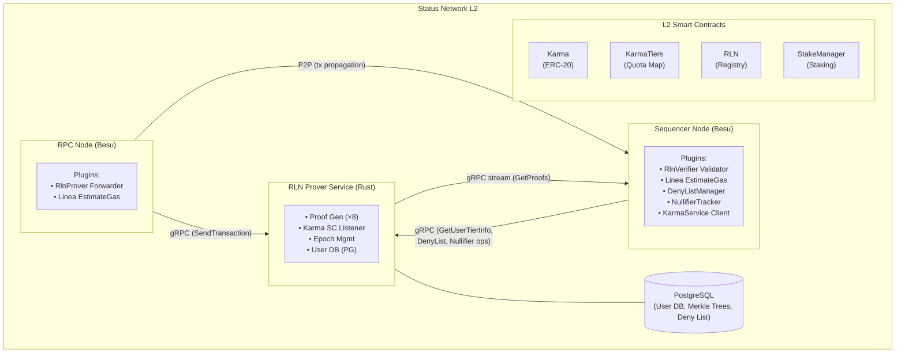
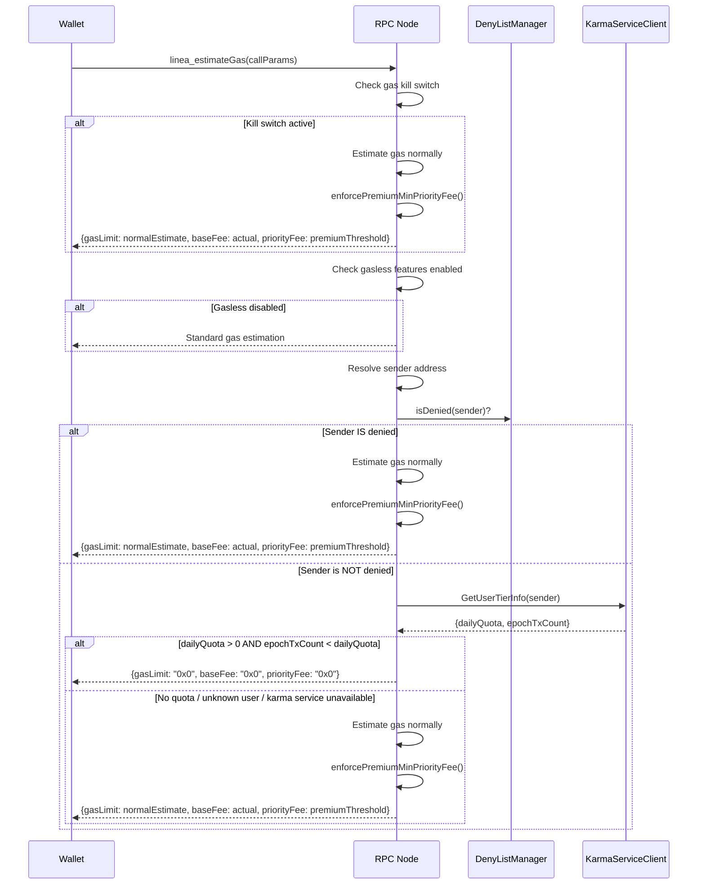
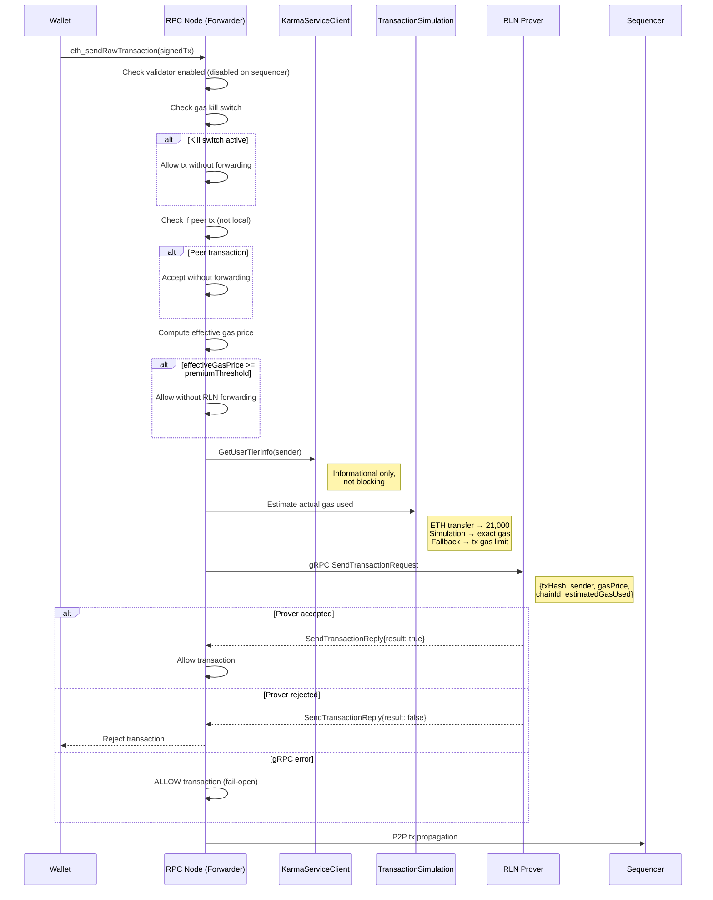
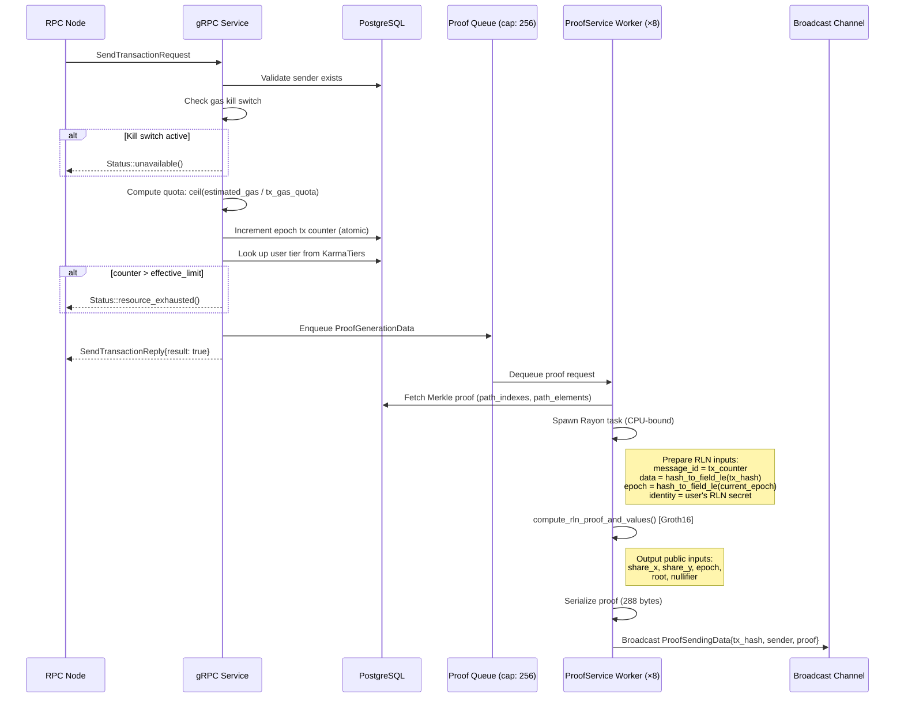
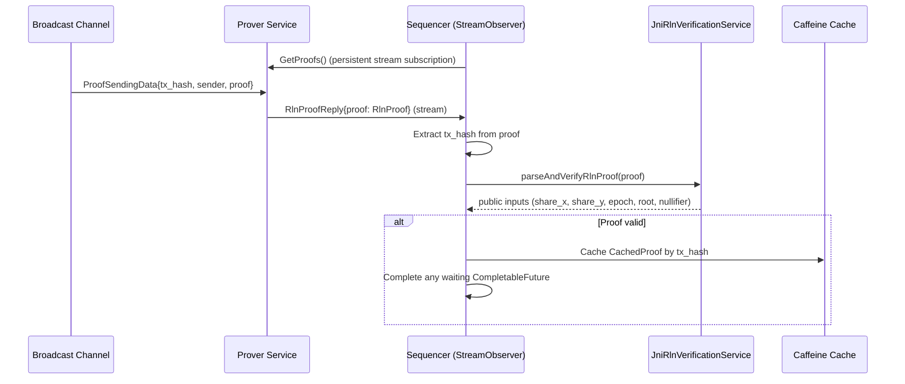
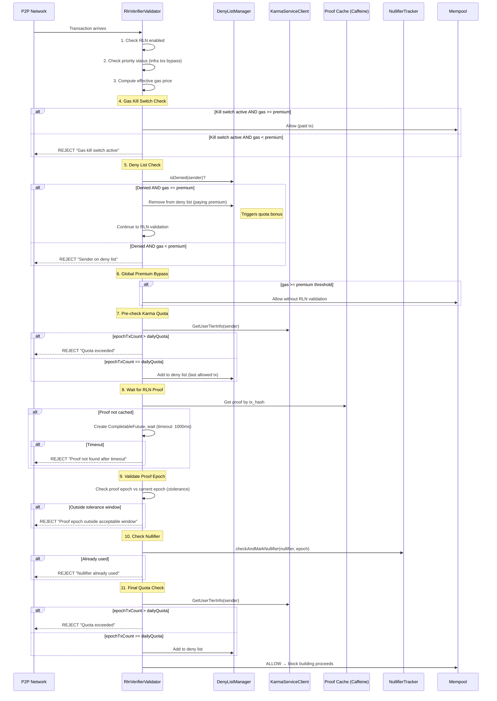
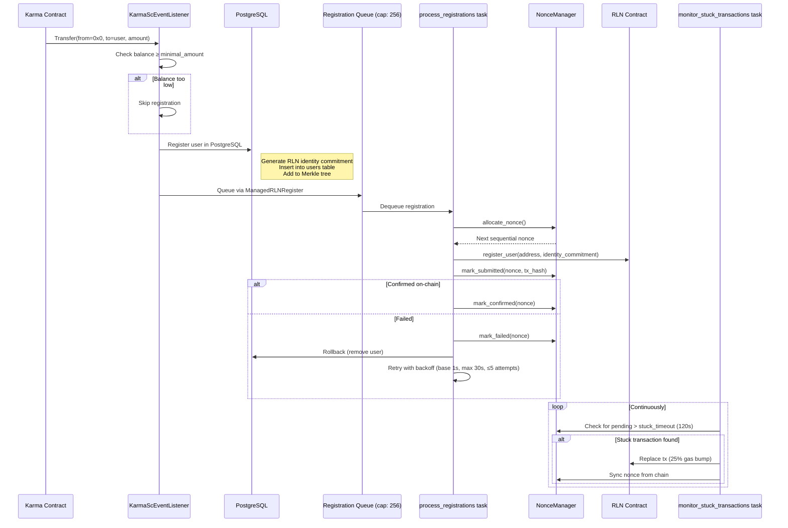

# Status Network Protocol Engineering

## Table of Contents

1. [Introduction](#introduction)
2. [Architecture Overview](#architecture-overview)
3. [Gasless Transaction Flow (End-to-End)](#gasless-transaction-flow-end-to-end)
4. [Component Deep Dives](#component-deep-dives)
   - [RPC Node Layer](#rpc-node-layer)
   - [RLN Prover Service](#rln-prover-service)
   - [Sequencer Node Layer](#sequencer-node-layer)
5. [Smart Contract Integration](#smart-contract-integration)
6. [Epoch and Quota Management](#epoch-and-quota-management)
7. [Security Mechanisms](#security-mechanisms)
8. [Configuration Reference](#configuration-reference)
9. [Deployment Topologies](#deployment-topologies)

---

## Introduction

Status Network is a gasless Ethereum L2 built on top of the Linea zkEVM stack. The whole point is to let users send transactions without paying gas, while not getting spam-nuked in the process.

We pull this off with three pieces. **RLN (Rate Limiting Nullifier)** is a zero-knowledge proof system from [Vac/Waku](https://github.com/vacp2p/zerokit) that enforces per-user rate limits without revealing who the user is. **Karma** is a non-transferable ERC-20 reputation token that determines how many gasless transactions you get per day. And **Besu Plugin Extensions** are the custom transaction pool validators and RPC modifications to the Linea Besu client that wire it all together.

This doc covers how these components talk to each other and what happens under the hood when a gasless transaction moves through the system.

### What's in here

The Besu RPC node mods (`RlnProverForwarderValidator`, `LineaEstimateGas`), the Rust RLN Prover service (Groth16 proof gen, user management, quota tracking), the sequencer mods (`RlnVerifierValidator`, deny lists, nullifier tracking), and how all of these talk to each other over gRPC.

### What's documented elsewhere

Smart contract specs for Karma, KarmaTiers, RLN, and StakeManager live in [`status-network-contracts/docs/`](../status-network-contracts/docs/). The base Linea architecture (sequencer, coordinator, provers, L1/L2 messaging) is covered in [`docs/architecture-description.md`](./architecture-description.md). Contract deployment procedures are in [`docs/status-network-deployment.md`](./status-network-deployment.md).

---

## Architecture Overview

### System Topology



**Key gRPC flows.** The RPC node sends `SendTransaction` to the prover to forward tx data for proof generation. The prover streams generated proofs back to the sequencer via `GetProofs`. And the sequencer calls back into the prover for `GetUserTierInfo`, deny list operations, and nullifier checks to enforce quotas.

### Node Roles

| Component | Role | Key Plugins/Validators | Facing |
|-----------|------|----------------------|--------|
| **RPC Node** | Accepts user transactions, forwards to prover | `RlnProverForwarderValidator`, `LineaEstimateGas` | User-facing |
| **RLN Prover** | Generates ZK proofs, manages quotas | gRPC service, Proof workers, Karma listener | Internal |
| **Sequencer** | Verifies proofs, enforces quotas, builds blocks | `RlnVerifierValidator`, `DenyListManager`, `NullifierTracker` | Internal |

---

## Gasless Transaction Flow (End-to-End)

Here's what happens when a single gasless transaction moves from the user's wallet through the system.

### Prerequisites

Before any of this works, the user needs to be registered in the RLN Registry contract. This happens automatically when a user first receives Karma tokens. The prover's `KarmaScEventListener` picks up the `Transfer` event (from the zero address, meaning a mint) and registers the user's identity commitment on-chain. They also need enough Karma to qualify for a tier in `KarmaTiers`, since higher balance means a higher tier and more free transactions per epoch. And their epoch transaction count has to be below their tier's limit.

### Step 1: Gas Estimation (`linea_estimateGas`)

The wallet calls `linea_estimateGas` on the RPC node. Our modified `LineaEstimateGas.java` runs through this:



**Source**: [`LineaEstimateGas.java:223-375`](../besu-plugins/linea-sequencer/sequencer/src/main/java/net/consensys/linea/rpc/methods/LineaEstimateGas.java)

When the wallet gets back all zeros, it knows to submit a `gasPrice = 0` transaction. The premium response enforces `priorityFee` to at least the premium threshold (configurable via `premiumGasPriceThresholdGWei`). Premium pricing is purely priority-fee-based — the gas limit is a normal estimate, not inflated. This matters because on Status Network both `baseFee` and `minGasPrice` are zero. Without this floor, the standard priority fee estimation returns near-zero values and wallets end up submitting transactions in a dead zone between 0 and the premium threshold that the sequencer just rejects.

### Step 2: Transaction Submission (`eth_sendRawTransaction`)

The signed transaction hits the RPC node's transaction pool. Besu runs it through its validator chain, and `RlnProverForwarderValidator` is first in line.



**Source**: [`RlnProverForwarderValidator.java:256-446`](../besu-plugins/linea-sequencer/sequencer/src/main/java/net/consensys/linea/sequencer/txpoolvalidation/validators/RlnProverForwarderValidator.java)

After the forwarder validator allows the transaction, Besu's standard transaction pool propagation sends the transaction to the sequencer node via P2P.

### Step 3: RLN Proof Generation (Prover Service)

The prover gets the `SendTransactionRequest` via gRPC and kicks off proof generation:



**Source**: [`grpc_service.rs`](../rln-prover/prover/src/grpc_service.rs), [`proof_service.rs`](../rln-prover/prover/src/proof_service.rs)

### Step 4: Proof Delivery via gRPC Streaming

The sequencer maintains a persistent gRPC streaming subscription to the prover service via `GetProofs()`. When a proof is broadcast:



Because proofs stream in asynchronously, they're usually cached before the sequencer's validator needs them. The Caffeine cache holds up to 10,000 proofs with a 5-minute TTL and LRU eviction.

### Step 5: Sequencer Validation (`RlnVerifierValidator`)

When the transaction lands in the sequencer's pool (via P2P), `RlnVerifierValidator` runs its checks:



**Source**: [`RlnVerifierValidator.java:924-1201`](../besu-plugins/linea-sequencer/sequencer/src/main/java/net/consensys/linea/sequencer/txpoolvalidation/validators/RlnVerifierValidator.java)

### Step 6: Block Building

After passing all validators (including the standard Linea ones for trace limits, gas limits, calldata, profitability, and simulation), the transaction enters the mempool. Standard Linea block building picks it up, includes it in a block, and it executes with `gasPrice = 0`. The user pays nothing.

---

## Component Deep Dives

### RPC Node Layer

The RPC node is a Besu instance running with `--plugin-linea-node-type=RPC`. We added two things to it.

#### Modified `LineaEstimateGas` RPC

**File**: [`LineaEstimateGas.java`](../besu-plugins/linea-sequencer/sequencer/src/main/java/net/consensys/linea/rpc/methods/LineaEstimateGas.java)

We extended the standard Linea `linea_estimateGas` endpoint with gasless logic that runs before the normal estimation. Three dependencies get injected via `SharedServiceManager`: the `DenyListManager` gives read-only access to the deny list (backed by gRPC to the prover service), the `KarmaServiceClient` queries user tier and quota information from the prover, and the `GasKillSwitchMonitor` provides a file-based emergency disable for all gasless features.

The gasless code path is marked with `// --- Linea Gasless Logic Start ---` / `// --- Linea Gasless Logic End ---` in the source. There's no middle ground on gas pricing. It's either zero or premium:

| Scenario | gasLimit | baseFee | priorityFee |
|----------|----------|---------|-------------|
| **Gasless** (user has Karma + available quota) | `0x0` | `0x0` | `0x0` |
| **Premium** (user on deny list, no Karma, quota exhausted, or karma service unavailable) | Normal estimate | Actual | max(estimated, premiumThreshold) |

Zero means "go ahead, gasless." Premium means "you're paying." Premium pricing is purely priority-fee-based — the gas limit is a normal estimate (no multiplier), and only the priority fee floor is enforced. The `enforcePremiumMinPriorityFee()` method takes the max of the standard estimation and the configured threshold. This is necessary because a zero-baseFee chain returns near-zero estimates and wallets submit into the dead zone.

Two flags control this: `--plugin-linea-rpc-gasless-enabled=true` enables the gasless code path, and `--plugin-linea-rpc-allow-zero-gas-estimation-for-gasless=true` allows returning 0 gas.

#### `RlnProverForwarderValidator`

**File**: [`RlnProverForwarderValidator.java`](../besu-plugins/linea-sequencer/sequencer/src/main/java/net/consensys/linea/sequencer/txpoolvalidation/validators/RlnProverForwarderValidator.java)

Only runs on RPC nodes (`--plugin-linea-rpc-rln-prover-forwarder-enabled=true`). It's positioned first in the validator chain, before trace limit, gas limit, calldata, and profitability validators.

One thing that tripped us up: the forwarder needs to estimate the actual gas the transaction will use *before* sending it to the prover. The prover needs this to figure out how many quota units to charge (`estimated_gas_used / tx_gas_quota`). For simple ETH transfers with empty calldata it hardcodes 21,000 gas. If `TransactionSimulationService` is available it runs a full EVM simulation for a more accurate number. Otherwise it falls back to the transaction's declared gas limit.

There are `AtomicInteger` counters for monitoring: `validationCallCount` tracks total validation calls, `localTransactionCount` and `peerTransactionCount` track local vs peer transactions, `grpcSuccessCount`/`grpcFailureCount` track gRPC outcomes, and `karmaBypassCount` counts transactions that had gasless priority.

#### Validator Chain Order

**File**: [`LineaTransactionPoolValidatorFactory.java`](../besu-plugins/linea-sequencer/sequencer/src/main/java/net/consensys/linea/sequencer/txpoolvalidation/LineaTransactionPoolValidatorFactory.java)

The factory wires up different validator chains depending on node type:

**RPC Node validator chain**:
1. `RlnProverForwarderValidator` ← Status Network addition
2. `TraceLineLimitValidator`
3. `AllowedAddressValidator`
4. `GasLimitValidator`
5. `CalldataValidator`
6. `ProfitabilityValidator`
7. `SimulationValidator`

**Sequencer validator chain**:
1. `TraceLineLimitValidator`
2. `AllowedAddressValidator`
3. `GasLimitValidator`
4. `CalldataValidator`
5. `ProfitabilityValidator`
6. `RlnVerifierValidator` ← Status Network addition
7. `SimulationValidator`

Note: `RlnProverForwarderValidator` only runs on RPC nodes; `RlnVerifierValidator` only runs on the sequencer. They are mutually exclusive.

#### SharedServiceManager

**File**: [`SharedServiceManager.java`](../besu-plugins/linea-sequencer/sequencer/src/main/java/net/consensys/linea/sequencer/txpoolvalidation/shared/SharedServiceManager.java)

Singleton that owns the shared gasless services. Gets initialized once at plugin startup and injected into both `LineaEstimateGas` and the validators.

| Service | Purpose | Backend |
|---------|---------|---------|
| `DenyListManager` | TTL-based deny list with gRPC sync | gRPC to prover's deny list endpoints |
| `KarmaServiceClient` | User tier and quota queries | gRPC `GetUserTierInfo` on prover |
| `NullifierTracker` | Nullifier deduplication (1M capacity, 2x epoch TTL) | In-memory Caffeine cache |
| `GasKillSwitchMonitor` | Emergency gasless disable | File polling (configurable path) |

Gasless services get initialized when any of `--plugin-linea-rln-enabled`, `--plugin-linea-rpc-gasless-enabled`, or `--plugin-linea-rpc-rln-prover-forwarder-enabled` is set to true.

---

### RLN Prover Service

Standalone Rust service that generates ZK proofs, manages users, and tracks quotas. Everything gasless flows through here.

**Source**: [`rln-prover/`](../rln-prover/)

#### gRPC Service Definition

**Proto file**: [`rln-prover/proto/net/vac/prover/prover.proto`](../rln-prover/proto/net/vac/prover/prover.proto)

```protobuf
service RlnProver {
  // Core proof generation
  rpc SendTransaction(SendTransactionRequest) returns (SendTransactionReply);
  rpc GetProofs(RlnProofFilter) returns (stream RlnProofReply);

  // Karma/Quota queries (used by Besu's KarmaServiceClient)
  rpc GetUserTierInfo(GetUserTierInfoRequest) returns (GetUserTierInfoReply);

  // Deny List management (used by Besu's DenyListManager)
  rpc IsDenied(IsDeniedRequest) returns (IsDeniedReply);
  rpc AddToDenyList(AddToDenyListRequest) returns (AddToDenyListReply);
  rpc RemoveFromDenyList(RemoveFromDenyListRequest) returns (RemoveFromDenyListReply);
  rpc GetDenyListEntry(GetDenyListEntryRequest) returns (GetDenyListEntryReply);

  // Nullifier tracking (used by Besu's NullifierTracker)
  rpc CheckNullifier(CheckNullifierRequest) returns (CheckNullifierReply);
  rpc RecordNullifier(RecordNullifierRequest) returns (RecordNullifierReply);
  rpc CheckAndRecordNullifier(CheckAndRecordNullifierRequest) returns (CheckAndRecordNullifierReply);
}
```

#### Proof Generation Pipeline

Proof generation is the hot path and has three stages.

**Stage 1: Request Acceptance** (`grpc_service.rs`). The service validates that the sender exists in the user database, computes the quota increment as `ceil(estimated_gas_used / tx_gas_quota)`, and atomically increments the user's epoch transaction counter in PostgreSQL. It then checks the counter against the user's tier limit and, if the user is within quota, enqueues a `ProofGenerationData` struct to a bounded async channel (capacity 256).

**Stage 2: Proof Computation** (`proof_service.rs`). Worker instances (configurable via `--proof-service`, default 8) consume from the async channel. Each worker fetches the user's Merkle proof from PostgreSQL and spawns a CPU-bound Rayon task to perform the actual Groth16 proof computation:
  ```
  Input:
    - identity_secret: User's RLN identity (from registration)
    - path_elements: Merkle tree sibling hashes
    - path_indexes: Left/right path through Merkle tree
    - message_id: Transaction counter (message_id within epoch)
    - data: hash_to_field_le(transaction_hash)
    - epoch: hash_to_field_le(current_epoch)
    - rln_identifier: Network-specific identifier string

  Output (public inputs):
    - share_x: X-coordinate of Shamir secret share
    - share_y: Y-coordinate of Shamir secret share
    - nullifier: Unique per-epoch nullifier (prevents double-spending)
    - root: Merkle tree root proving membership
    - epoch: The epoch field element used in proof
  ```

**Stage 3: Broadcast** (`proof_service.rs`). The serialized proof (288 bytes) is broadcast via a Tokio broadcast channel so all `GetProofs` stream subscribers receive it in real-time. Metrics for proof generation time and proof count are recorded at this stage.

**Rate Limit Edge Case.** When `tx_counter == rate_limit`, the proof service uses `message_id = tx_counter - 1`. This is a protocol requirement of the Zerokit RLN implementation. The verifier needs to be able to recover the secret hash from the Shamir shares, which requires the message_id to be within the valid range.

#### User Registration Flow

User registration is an async pipeline with three background tasks. The `KarmaScEventListener` detects mints, a `ManagedRLNRegister` queues registrations, and a `NonceManager` sequences on-chain transactions with retry and gas-bumping:



The `NonceManager` is backed by PostgreSQL so pending registrations survive prover restarts. On startup, `recover_pending()` picks up any registrations that were in-flight when the service last stopped. Registration gas price must be at least the premium threshold to bypass RLN validation on the sequencer (configurable via `--registration-gas-price-gwei`).

If the DB insert succeeds but the on-chain registration ultimately fails after all retries, the DB entry is rolled back. The system maintains the invariant that either both the DB and the contract have the user, or neither does.

#### Epoch Management

The `EpochService` handles quota reset cycles:

| Setting | Production | Testing |
|---------|-----------|---------|
| Epoch duration | 24 hours (86,400s) | 60 seconds |

**Epoch calculation**:
```
current_epoch = (now - genesis) / epoch_duration
```

Every epoch transition, `UserDbService` zeros out all transaction counters in PostgreSQL. The proof's epoch field element is `hash_to_field_le(current_epoch)`.

#### Database Schema

PostgreSQL backs all persistent state. The `users` table maps addresses to RLN identity commitments, and `tx_counter` tracks each address's current epoch and counter for quota enforcement. Merkle tree state is split across `m_tree_config` (tree-level configs like depth and next index) and `pgfr_mtree_N` tables (per-tree node storage, powered by the `pg_merkle_tree` extension). The `tier_limits` table holds tier name to quota mappings, synced from the KarmaTiers contract. The `deny_list` table stores addresses with TTL-based expiry, and `nullifiers` records per-epoch nullifiers for replay prevention.

---

### Sequencer Node Layer

The sequencer runs Besu with `--plugin-linea-node-type=SEQUENCER`. It's the final authority. If the sequencer says no, the transaction doesn't go through.

#### `RlnVerifierValidator`

**File**: [`RlnVerifierValidator.java`](../besu-plugins/linea-sequencer/sequencer/src/main/java/net/consensys/linea/sequencer/txpoolvalidation/validators/RlnVerifierValidator.java)

Most complex component in the system. A few things worth calling out:

Everything is `static` and there's a good reason for that. Besu's `createTransactionValidator()` creates new validator instances for each validation call. If the proof cache, pending futures, and gRPC subscription weren't static, each instance would spin up its own gRPC subscription and cache, and proofs would get lost. This was a fun one to debug.

When a transaction shows up before its proof, the validator creates a `CompletableFuture<CachedProof>` and blocks on it with a configurable timeout. When the proof arrives via the gRPC stream, `StreamObserver.onNext()` completes the future and unblocks the validation thread. No polling. There's a concurrency cap of 100 concurrent proof waits via an `AtomicInteger` counter, because without it a burst of transactions without proofs would exhaust resources.

The validator calls into the Rust `zerokit` library via `JniRlnVerificationService` for proof verification. `parseAndVerifyRlnProof` handles both parsing and cryptographic verification, and only verified proofs get cached.

Different epoch modes allow different staleness:

| Mode | Current Epoch | Tolerance |
|------|--------------|-----------|
| `BLOCK` | SHA-256 hash of block number | ±2 blocks |
| `TIMESTAMP_1H` | SHA-256 hash of hourly timestamp | ±1 hour |
| `TEST` / `FIXED_FIELD_ELEMENT` | Hardcoded values | Always valid |

The proof stream reconnects with exponential backoff. It starts from the base delay configured in `rlnProofStreamRetryIntervalMs` and doubles on each retry up to `maxBackoffDelayMs`. After `rlnProofStreamRetries` consecutive failures it gives up, and the retry count resets on any successful message.

#### DenyListManager

Shared between `LineaEstimateGas` and `RlnVerifierValidator`. The sequencer writes to it (adds users when they hit their quota), and the gas estimation endpoint reads from it (denied users get premium pricing instead of zero). Entries have a TTL and expire automatically. Users can also clear themselves by paying premium gas on their next transaction — when the sequencer sees a denied user paying premium, it calls `RemoveFromDenyList` which triggers the [quota bonus mechanism](#quota-bonus-deny-list-recovery) to restore gasless access without resetting the epoch counter.

Backed by the prover's PostgreSQL via gRPC, so deny list state survives node restarts.

#### NullifierTracker

Prevents proof replay within an epoch using an in-memory Caffeine cache. The cache holds up to 1,000,000 entries (enough for 500+ TPS) with a TTL of 2x the epoch duration to ensure coverage across epoch boundaries. The `checkAndMarkNullifier(nullifier, epoch)` call does an atomic check-and-set. If the same nullifier appears twice in one epoch it gets rejected, which stops someone from capturing a valid proof and replaying it.

---

## Smart Contract Integration

Four contracts matter for gasless. Full specs live in [`status-network-contracts/docs/`](../status-network-contracts/docs/). Here's how they plug into the protocol layer:

### Karma (ERC-20)

Karma is non-transferable. Users cannot send it to others, though transfer whitelisting controls exceptions for specific addresses. The prover's `KarmaScEventListener` watches for `Transfer` events from the zero address (minting) to detect new users who should be registered for RLN. When the sequencer needs to check a user's tier, the `GetUserTierInfo` gRPC call reads the user's Karma balance from the contract.

### KarmaTiers

Each tier defines a name, a karma range, and a transaction quota per epoch. The prover's `TiersListener` watches for tier updates on-chain and syncs them to PostgreSQL. Tiers must be contiguous, and the first tier must start at minKarma=0. The actual tiers deployed via [`scripts/initialize-karma-tiers.ts`](../scripts/initialize-karma-tiers.ts):

| Tier ID | Name | Karma Range (tokens) | TX per Epoch |
|---------|------|----------------------|--------------|
| 0 | none | 0 to <1 | 0 |
| 1 | entry | 1 | 2 |
| 2 | newbie | >1 to <50 | 6 |
| 3 | basic | 50 to <500 | 16 |
| 4 | active | 500 to <5,000 | 96 |
| 5 | regular | 5,000 to <20,000 | 480 |
| 6 | power | 20,000 to <100,000 | 960 |
| 7 | pro | 100,000 to <500,000 | 10,080 |
| 8 | high-throughput | 500,000 to <5,000,000 | 108,000 |
| 9 | s-tier | 5,000,000 to <10,000,000 | 240,000 |
| 10 | legendary | 10,000,000+ | 480,000 |

Users with zero karma (tier "none") cannot make gasless transactions at all. Karma uses 18 decimals like a standard ERC-20.

### RLN Registry

The RLN Registry stores Poseidon hash commitments for each registered user. The prover calls `register_user()` when a new user is detected via Karma events. If a user is slashed through the commit-reveal mechanism, the `AccountSlashed` event triggers user removal from the prover's database.

### StakeManager

Users earn Karma by staking, which flows through reward distributors. The chain is: stake to earn Karma, Karma determines tier, and tier determines gasless quota.

---

## Epoch and Quota Management

### How Quotas Work

Each epoch (default 24 hours in production) starts with all users' transaction counters at zero. When a user sends a gasless transaction, the prover increments their counter. The amount consumed depends on the transaction's gas usage: `increment = ceil(estimated_gas_used / tx_gas_quota)`. Once the counter reaches the user's tier limit, they get added to the deny list. At epoch reset, all counters return to zero and deny list entries eventually expire.

### Quota Bonus (Deny List Recovery)

When a denied user pays premium gas, they can recover gasless quota mid-epoch without waiting for the epoch to reset. But we can't just reset their transaction counter to zero — the RLN proof's `message_id` is derived from the counter, and resetting it would cause nullifier collisions with proofs already generated earlier in the epoch.

Instead, the system adds a **quota bonus** to the user's effective tier limit. When `remove_from_deny_list` is called with `reset_epoch_counter=true`, the prover fetches the user's tier limit and adds it as a bonus:

```
effective_limit = tier.tx_per_epoch + quota_bonus
```

For example, a "basic" tier user with 16 tx/epoch who hits their limit at counter=16 and then pays premium gas gets `quota_bonus += 16`, making their effective limit 32. Their counter stays at 16 and continues incrementing from there, so `message_id` values remain unique. The bonus is stored in the `tx_counter` table's `quota_bonus` column and resets to zero at epoch boundaries along with everything else.

### Gas-Weighted Quotas

Quotas aren't just counted by transaction. They're weighted by gas. The `tx_gas_quota` parameter (default 100,000 gas units) defines one "quota unit":

| Transaction | Gas Used | Quota Units Consumed |
|------------|----------|---------------------|
| Simple ETH transfer | 21,000 | 1 |
| ERC-20 transfer | ~65,000 | 1 |
| Complex contract call | 200,000 | 2 |
| Very heavy computation | 500,000 | 5 |

Without gas-weighting, a user could blow their entire quota on a few heavy contract calls while barely touching block space with simple transfers.

### Epoch Modes

| Mode | Epoch Identifier | Use Case |
|------|-----------------|----------|
| `BLOCK` | SHA-256 hash of block number + salt | Fine-grained, per-block quotas |
| `TIMESTAMP_1H` | SHA-256 hash of hourly timestamp + salt | Production default |
| `TEST` | Hardcoded value | Local development |
| `FIXED_FIELD_ELEMENT` | Hardcoded field element | Debugging |

Prover and sequencer compute epochs independently, but that's fine. The epoch value is embedded in the ZK proof, and the sequencer validates it against its own calculation with a tolerance window.

---

## Security Mechanisms

### RLN Cryptographic Properties

The ZK proof includes a Merkle tree root that proves the user is in the RLN group without revealing which member they are. Each proof also includes a `message_id` (tx counter) and epoch. If a user exceeds their rate limit, they reveal their secret key via Shamir's Secret Sharing and their karma gets slashed. Every (user, epoch, message_id) tuple produces a unique nullifier, and the sequencer's NullifierTracker prevents any nullifier from being used twice. Proofs are bound to the user's identity secret, which is derived from their RLN registration, so they can't be transferred to someone else.

### Defense Layers

| Layer | Mechanism | Enforced By |
|-------|-----------|-------------|
| **Rate limiting** | RLN proof embeds tx counter | Prover (generation) + Sequencer (verification) |
| **Quota enforcement** | Karma tier to daily limit | Sequencer (KarmaServiceClient check) |
| **Replay prevention** | Nullifier tracking | Sequencer (NullifierTracker) |
| **Epoch validation** | Proof epoch vs current epoch | Sequencer (tolerance window) |
| **Premium gas fallback** | Pay to bypass RLN | Both RPC and Sequencer |
| **Deny list** | Block quota-exceeded users | Sequencer (DenyListManager) |
| **Kill switch** | Emergency disable | All components (file-based) |
| **Slashing** | Secret recovery from over-use | On-chain (RLN contract) |

### Kill Switch

**File**: [`GasKillSwitchMonitor.java`](../besu-plugins/linea-sequencer/sequencer/src/main/java/net/consensys/linea/config/GasKillSwitchMonitor.java), [`kill_switch.rs`](../rln-prover/prover/src/kill_switch.rs)

Dead simple file-based emergency mechanism shared across all components. Write `"true"` or `"enabled"` to the configured file path to activate, and any other value (or delete the file) to deactivate. Each component polls the file every 5 seconds by default. When active, the RPC node returns premium gas estimates (instead of zero-gas) and skips prover forwarding, the sequencer rejects all gasless transactions (premium gas still works), and the prover returns `Status::unavailable()` for new proof requests.

#### Docker Compose

In Docker Compose, the kill switch is managed via a shared named volume (`gas-kill-switch`) mounted on sequencer, l2-node-besu, l2-node-besu-follower, and rln-prover.

```bash
# Activate (disable all gasless transactions)
docker exec sequencer sh -c 'echo true > /var/lib/besu/kill-switch/gas-kill-switch'

# Deactivate (re-enable gasless transactions)
docker exec sequencer sh -c 'echo false > /var/lib/besu/kill-switch/gas-kill-switch'

# Check current state
docker exec sequencer cat /var/lib/besu/kill-switch/gas-kill-switch

# Verify via logs
docker logs sequencer 2>&1 | grep -i "kill switch"
docker logs rln-prover 2>&1 | grep -i "kill switch"
```

Propagation time: ~5 seconds (one poll interval). All services sharing the volume see the change immediately.

#### Kubernetes

In Kubernetes, the kill switch is managed via a ConfigMap mounted as a volume:

```yaml
apiVersion: v1
kind: ConfigMap
metadata:
  name: gas-kill-switch
data:
  gas-kill-switch: "false"
```

All L2 services mount this ConfigMap at `/var/lib/besu/kill-switch/gas-kill-switch`.

```bash
# Activate (disable all gasless transactions)
kubectl patch configmap gas-kill-switch -n <namespace> \
  -p '{"data":{"gas-kill-switch":"true"}}'

# Deactivate (re-enable gasless transactions)
kubectl patch configmap gas-kill-switch -n <namespace> \
  -p '{"data":{"gas-kill-switch":"false"}}'

# Check current ConfigMap state
kubectl get configmap gas-kill-switch -n <namespace> -o jsonpath='{.data.gas-kill-switch}'

# Verify propagation via logs
kubectl logs -n <namespace> deployment/sequencer | grep -i "kill switch"
kubectl logs -n <namespace> deployment/rln-prover | grep -i "kill switch"
```

Propagation time: ~30-60 seconds (kubelet ConfigMap volume sync) + 5 seconds (poll interval).

### Fail-Open vs Fail-Secure

Different components fail differently:

| Component | Failure Mode | Strategy | Rationale |
|-----------|-------------|----------|-----------|
| RPC Forwarder → Prover | gRPC timeout/error | **Fail-open** (allow tx) | User experience; sequencer will catch invalid txs |
| Sequencer → Proof cache | Proof not found | **Fail-secure** (reject tx) | Cannot process gasless tx without proof |
| Sequencer → Karma service | Service unavailable | **Fail-secure** (reject tx) | Cannot verify quota without karma data |
| RPC → Karma service | Service unavailable | **Graceful** (standard gas) | Fall back to normal gas estimation |

---

## Configuration Reference

### Besu Plugin CLI Options

**File**: [`LineaRlnValidatorCliOptions.java`](../besu-plugins/linea-sequencer/sequencer/src/main/java/net/consensys/linea/config/LineaRlnValidatorCliOptions.java)

| Option | Default | Description |
|--------|---------|-------------|
| `--plugin-linea-rln-enabled` | `false` | Enable RLN validation (sequencer-side verification) |
| `--plugin-linea-rln-verifying-key` | — | Path to RLN verifying key file |
| `--plugin-linea-rln-proof-service` | `localhost:50051` | RLN proof service gRPC endpoint (host:port) |
| `--plugin-linea-rln-karma-service` | `localhost:50052` | Karma service gRPC endpoint (host:port) |
| `--plugin-linea-rln-use-tls` | auto | Use TLS for gRPC connections |
| `--plugin-linea-rln-premium-gas-threshold-gwei` | `12` | Premium gas threshold in GWei |
| `--plugin-linea-rln-epoch-mode` | `TIMESTAMP_1H` | Epoch strategy (BLOCK, TIMESTAMP_1H, TEST) |
| `--plugin-linea-rpc-rln-prover-forwarder-enabled` | `false` | Enable RLN prover forwarder on RPC nodes |
| `--plugin-linea-rpc-gasless-enabled` | `false` | Enable gasless features in linea_estimateGas |
| `--plugin-linea-rpc-allow-zero-gas-estimation-for-gasless` | `false` | Allow returning 0 gas estimate |
| `--plugin-linea-gas-kill-switch-file` | — | Path to gas kill switch file |
| `--plugin-linea-gas-kill-switch-poll-seconds` | `5` | Kill switch file poll interval |

### RLN Prover Service CLI Options

**File**: [`args.rs`](../rln-prover/prover/src/args.rs)

| Option | Default | Description |
|--------|---------|-------------|
| `--ip` | `::1` | Server bind address |
| `--port` | `50051` | gRPC server port |
| `--ws-rpc-url` | — | Blockchain WebSocket RPC URL |
| `--db` | — | PostgreSQL connection string |
| `--ksc` | — | Karma smart contract address |
| `--rlnsc` | — | RLN Registry smart contract address |
| `--tsc` | — | KarmaTiers smart contract address |
| `--rln-identifier` | `"test-rln-identifier"` | RLN network identifier |
| `--spam-limit` | `10000` | Global rate limit (max txs per epoch) |
| `--tx-gas-quota` | `100000` | Gas units per counted transaction |
| `--epoch-duration-secs` | `86400` | Epoch duration in seconds |
| `--proof-service` | `8` | Number of proof generation workers |
| `--broadcast-channel-size` | `100` | Broadcast channel buffer size |
| `--transaction-channel-size` | `256` | Proof request queue depth |
| `--kill-switch-file` | `""` | Path to kill switch file |
| `--kill-switch-poll-secs` | `5` | Kill switch poll interval |
| `--mock-sc` | `false` | Use mock smart contracts |
| `--mock-user` | — | Path to mock users JSON file |
| `--metrics-port` | `30031` | Prometheus metrics port |

---

## Deployment Topologies

### Docker Compose (Local Development)

**File**: [`docker/compose-spec-l2-services-rln.yml`](../docker/compose-spec-l2-services-rln.yml)

```
L1 Network (10.10.10.0/24)
    │
    ├── L1 Node (geth/besu)
    │
L2 Network (11.11.11.0/24)
    │
    ├── Sequencer (SEQUENCER mode)
    │   ├── RLN validation: enabled
    │   ├── Prover forwarder: disabled
    │   ├── Storage: FOREST
    │   └── Epoch mode: TEST (30s)
    │
    ├── RPC Node (RPC mode)
    │   ├── RLN validation: disabled (no proof verification on RPC)
    │   ├── Prover forwarder: enabled
    │   ├── Gasless: enabled
    │   ├── Storage: BONSAI
    │   └── Premium threshold: 12 GWei
    │
    ├── RPC Follower Node (RPC mode)
    │   └── (Same config as RPC node)
    │
    ├── RLN Prover
    │   ├── Port: 50051 (gRPC)
    │   ├── Mock SC mode for local dev
    │   ├── Epoch: 30s / 10s slices
    │   └── Kill switch: shared volume
    │
    └── PostgreSQL
        └── Database: prover_db
```

### Kubernetes / Helm (Production)

**Files**: [`k8s/helm/status-network/`](../k8s/helm/status-network/)

The Helm chart deploys everything with production config. The main differences from local dev are that epoch mode is `TIMESTAMP_1H` (24-hour epochs instead of 30-second test epochs), real smart contract addresses are used instead of mock mode, TLS is enabled for gRPC connections, and resource limits and replica counts are higher.

### Configuration by Node Role

| Setting | RPC Node | Sequencer |
|---------|----------|-----------|
| `--plugin-linea-node-type` | `RPC` | `SEQUENCER` |
| `--plugin-linea-rln-enabled` | `false` | `true` |
| `--plugin-linea-rpc-rln-prover-forwarder-enabled` | `true` | `false` |
| `--plugin-linea-rpc-gasless-enabled` | `true` | `false` |
| `--plugin-linea-rpc-allow-zero-gas-estimation-for-gasless` | `true` | — |
| `--plugin-linea-rln-premium-gas-threshold-gwei` | `12` | `12` |
| `data-storage-format` | `BONSAI` | `FOREST` |
| `tx-pool-simulation-check-api-enabled` | `true` | — |

---

## Summary of Modifications from Base Linea

Everything we added or changed on top of Linea:

### New Files (Status Network Additions)

| File | Purpose |
|------|---------|
| `RlnProverForwarderValidator.java` | RPC-side tx forwarding to prover service |
| `RlnVerifierValidator.java` | Sequencer-side proof verification and quota enforcement |
| `LineaRlnValidatorCliOptions.java` | CLI configuration for all RLN/gasless options |
| `LineaRlnValidatorConfiguration.java` | Configuration record for RLN settings |
| `GasKillSwitchMonitor.java` | File-based emergency kill switch |
| `SharedServiceManager.java` | Singleton lifecycle management for shared gasless services |
| `DenyListManager.java` | gRPC-backed deny list with TTL |
| `KarmaServiceClient.java` | gRPC client for karma/quota queries |
| `NullifierTracker.java` | High-performance nullifier deduplication |
| `JniRlnVerificationService.java` | JNI bridge to Rust zerokit for proof verification |
| `rln-prover/` (entire crate) | Rust RLN proof generation service |

### Modified Files (Linea Extensions)

| File | Modification |
|------|-------------|
| `LineaEstimateGas.java` | Added gasless logic: deny list check, karma query, zero gas response path |
| `LineaEstimateGasEndpointPlugin.java` | Inject SharedServiceManager dependencies (DenyListManager, KarmaServiceClient, GasKillSwitchMonitor) |
| `LineaTransactionPoolValidatorFactory.java` | Add RlnProverForwarderValidator (RPC) and RlnVerifierValidator (sequencer) to validator chains |

### Integration Pattern

Everything is gated behind CLI flags (`--plugin-linea-rln-enabled`, `--plugin-linea-rpc-gasless-enabled`, etc.). When disabled, the system behaves identically to base Linea. New dependencies go through `SharedServiceManager` and get injected at plugin init. Every external service call (prover, karma) has explicit fallback behavior. The sequencer always enforces full validation regardless. The RPC node can be more relaxed because it only controls what enters the mempool, not what gets included in blocks.
