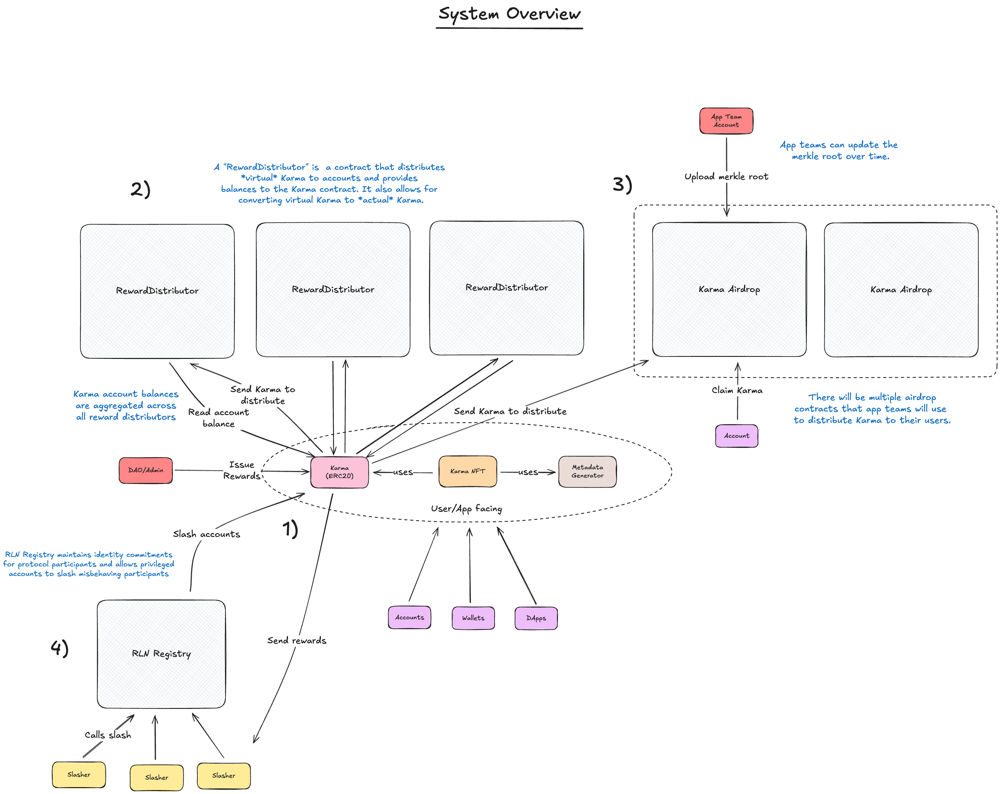

# System Overview

This document provides an overview of the system architecture and design of the Karma reward and reputation system.
We'll learn about the system components, their interactions, and the data flow between them.

The figure above illustrates the main components of the Karma reward and reputation system. Below is a brief description
of each component:

1. **Karma Token Contract**: An ERC20 contract that manages the issuance and accounting of [Karma tokens](karma.md). The
   entire Karma system revolves around this contract. The token contract is accompanied by a non-transferable ERC721
   contract that represents Karma NFTs. These NFTs are used to visually represent an account's Karma level. Karma
   rewards are distributed through various reward distributors by privileged entities.

2. **Reward Distributors**: Contracts that implement custom reward logic and distribute Karma tokens to accounts.
   [Reward distributors](reward-distributors.md) track "virtual" Karma balances for participants based on their specific
   reward mechanisms. This allows for real-time reward accrual without requiring constant token transfers. However, the
   (virtual) rewards are always backed by actual Karma tokens held by the distributor. The Karma contract aggregates the
   total Karma balance of each account by querying all registered reward distributors. Virtual rewards can be redeemed
   for actual tokens at any time to enable voting or transfers.

3. **Karma Airdrop Contract**: [A merkle root airdrop contract](karma-airdrop.md) used to distribute Karma tokens to
   accounts to onboard them to the system, or as reccourring rewards for specific activities. Multiple instances of this
   contract can exist simultaneously with different configurations, allowing privileged entities to update the merkle
   root on a regular basis.

4. **RLN Registry**: The [RLN Registry](rln.md) is a spam prevention mechanism that integrates with the Karma system to
   enforce slashing of misbehaving accounts. If an account violates certain rules, its Karma can be slashed by
   privileged entities through the RLN Registry. Before slashing, the system redeems any virtual Karma rewards to ensure
   accurate accounting.

## How the system works

- The Karma token is used as a reputation mechanism within the Status Network ecosystem. Accounts need Karma to send
  transactions for free on the network. To earn Karma, accounts participate in various activities through reward
  distributors.
- Karma rewards are issued and allocated by privileged entities, such as the DAO or system administrators, to reward
  distributors. These then distribute (virtual) Karma to accounts based on their specific logic.
- Accounts can view their total Karma balance in their wallets, which includes both actual tokens and virtual rewards.
- The Karma token is generally non-transferable, however some selected accounts can be whitelisted by administrators to
  enable transfers.
- Transferring virtual Karma is not possible, so accounts will have to redeem earned virtual Karma to actual tokens
  first.
- Redeeming virtual Karma also enaables the token's voting capabilities.
- Proper Karma tokens can and will be distributed via airdrop contracts as well. These contracts allow for updating the
  merkle root regularly to distribute Karma to accounts.
- If users misbehave, their Karma can be slashed by privileged entities. This happens through the [RLN Registry](rln.md)
